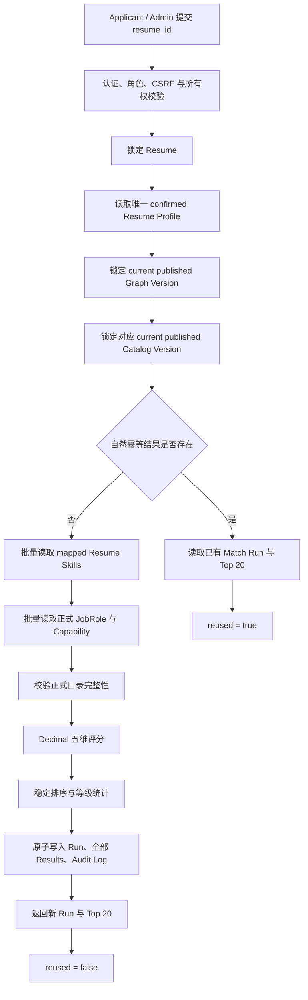

# Applicant 岗位推荐与人岗匹配开发完成报告

## 1. 报告信息

| 项目 | 内容 |
| --- | --- |
| 系统名称 | 岗位能力图谱系统后端 |
| 本次交付 | Applicant 岗位推荐与人岗匹配闭环 |
| 报告日期 | 2026-08-07 |
| 开发状态 | 已完成并通过工程验收 |
| 开发分支 | `codex/applicant-matching` |
| 交付提交 | `6ddc633eaf341bdcc7c41462d31e144f2cd699ed` |
| 远端状态 | 本报告编写前，分支已与 `origin/codex/applicant-matching` 同步 |
| 技术栈 | Python 3.12、FastAPI、Pydantic 2、SQLAlchemy 2、PostgreSQL 16、Alembic、pytest、Ruff、Docker Compose |

## 2. 执行摘要

本阶段已经完成应聘者侧从“已确认简历画像”到“岗位推荐、匹配解释、技能差距和历史记录”的后端闭环。

应聘者选择一份已有简历后，系统会自动读取该简历当前唯一的 `confirmed` Resume Profile，锁定当前正式发布的 Graph Version 和完整 Catalog Version，对目录内全部正式岗位执行确定性五维评分，保存完整不可变的 Match Run 和 Match Result，再返回排名前 20 的岗位。应聘者可以继续查询历史批次、分页查看全部岗位结果，并打开单个岗位查看匹配技能、缺失技能和各维度评分依据。

本阶段的关键交付不是一个仅用于展示的临时分数接口，而是一条可以在团队内部真实使用、可以重复执行、可以解释、可以审计、可以追溯历史版本的推荐链路。匹配结果不依赖 LLM 的临场输出，相同输入在同一算法版本下会得到相同结果。

当前工程验收结果为：

- 后端全量测试：`452 passed`；
- Ruff：`All checks passed!`；
- Docker Compose 配置校验：通过；
- Alembic 测试数据库迁移：`0011 -> 0010 -> 0011` 通过；
- API Docker 镜像构建：通过；
- OpenAPI 岗位推荐路由检查：通过。

需要特别说明：`452 passed` 证明代码行为、权限、约束、事务和接口符合设计，不代表业务匹配准确率已经达到 90%。90% 业务准确率必须使用人工标注的 Resume-JobRole 测试集单独评估，本阶段没有伪造该结论。

## 3. 本阶段目标与完成情况

| 目标 | 完成状态 | 交付结果 |
| --- | :---: | --- |
| 使用已确认简历画像进行岗位匹配 | 已完成 | 只读取目标 Resume 当前唯一 `confirmed` Profile |
| 只匹配正式发布岗位 | 已完成 | 岗位集合锚定 current Graph/Catalog 水位 |
| 综合技能、证据、经验和学历评分 | 已完成 | 固定五维算法 `match_weights_v1` |
| 输出高、中、低匹配等级 | 已完成 | 阈值固定并经过边界测试 |
| 返回岗位推荐列表 | 已完成 | POST 默认返回 Top 20 |
| 保存全部岗位结果 | 已完成 | 所有岗位均写入 Match Result，不只保存 Top 20 |
| 展示岗位匹配与差距明细 | 已完成 | 返回匹配技能、缺失技能、五维分和差距统计 |
| 查询历史匹配记录 | 已完成 | 支持历史列表和结果分页 |
| 保证历史可追溯 | 已完成 | 保存岗位、权重、版本和技能差距快照 |
| 防止重复计算 | 已完成 | 采用数据库自然幂等键复用已有结果 |
| 三角色权限隔离 | 已完成 | Applicant、Admin、HR 权限边界明确 |
| 原子事务和并发保护 | 已完成 | Run、Results、Audit Log 同一事务提交 |
| 工程测试与部署验证 | 已完成 | 测试、静态检查、迁移、镜像和路由均通过 |

## 4. 用户可用能力

### 4.1 创建岗位推荐

Applicant 可以选择自己的一份未归档 Resume 发起推荐。调用方只提交 `resume_id`，不能人为指定 Profile、Catalog、Graph Version、权重、阈值或证据系数。

后端自动完成以下工作：

1. 校验登录身份、角色和 Resume 所有权；
2. 锁定 Resume，避免匹配过程中与画像确认或归档操作交错；
3. 选择该 Resume 当前唯一的 `confirmed` Profile；
4. 选择 current published Graph Version；
5. 沿 Graph Version 锁定对应的 current published Catalog Version；
6. 批量读取正式岗位及岗位技能要求；
7. 对全部岗位执行五维评分和稳定排序；
8. 原子保存 Match Run、全部 Match Result 和审计记录；
9. 返回 Run 摘要和 Top 20 岗位结果。

### 4.2 查看推荐历史

系统保存每次输入水位发生变化后产生的推荐批次。Applicant 可以分页查看自己的历史 Match Run，Admin 可以查看全部 Match Run，并可按 `resume_id` 过滤，用于内部排查和演示。

历史记录包含：

- Resume 和 Resume Profile 版本；
- Graph Version 和 Catalog Version；
- 算法权重版本；
- 岗位结果总数；
- high、medium、low 数量；
- 创建时间。

### 4.3 查看完整岗位排名

POST 只返回 Top 20，以控制首次响应体大小；数据库仍然保存本次正式目录内的全部岗位结果。用户可以通过 Match Run 结果接口分页查看完整排名，默认每页 20 条，最大每页 100 条。

### 4.4 查看单岗位差距

单岗位明细接口返回：

- 岗位名称、说明和所属 Domain 快照；
- 总分和 high/medium/low 等级；
- 必备技能覆盖率；
- 加分技能覆盖率；
- 技能证据质量；
- 工作经验匹配分；
- 学历匹配分；
- 已匹配的 required/bonus 技能；
- 缺失的 required/bonus 技能；
- 各技能的 importance；
- 简历中的证据强度和 evidence quote；
- 匹配、缺失技能数量汇总。

这部分结果可以直接作为后续成长路径模块的事实输入。成长路径只需要读取缺失的 required Capability，不需要重新解释简历或重新计算岗位差距。

## 5. 完整业务流程



## 6. 技术架构与模块边界

### 6.1 真相源

PostgreSQL 是本阶段的唯一业务真相源，负责保存：

- Resume 和 confirmed Resume Profile；
- Profile 中已映射的标准技能；
- Graph/Catalog 正式发布水位；
- JobRole、Capability 和岗位技能关系；
- Match Run、Match Result 和历史快照；
- Audit Log。

Neo4j 继续只承担审核通过、正式发布图谱的可视化读取，不参与人岗匹配计算。这样避免 PostgreSQL 和 Neo4j 双读造成的一致性窗口，也避免推荐功能因图数据库不可用而失败。

### 6.2 Matching 模块

本阶段新增独立 `backend/app/matching/` 模块，职责如下：

| 文件 | 职责 |
| --- | --- |
| `models.py` | Match Run、Match Result ORM、索引和数据库约束 |
| `schemas.py` | 严格请求模型、Run/列表/明细响应模型 |
| `scoring.py` | 无数据库依赖的 Decimal 纯评分、快照构造和稳定排序 |
| `service.py` | 权限、行锁、版本选择、目录读取、幂等、事务、查询和审计 |
| `router.py` | FastAPI 路由、分页参数、CSRF 和统一响应包装 |

该边界允许未来 HR 招聘模块复用纯评分函数，但不允许绕过 Applicant 私有资源权限直接复用 Applicant API。

### 6.3 明确未进入匹配调用链的组件

本阶段生产匹配调用链不使用：

- LLM；
- Algorithm Service；
- LangChain；
- LangGraph；
- Celery；
- Redis；
- Neo4j；
- 向量数据库或语义检索。

这些组件并不是从整个系统中删除。LLM 仍可服务于上游简历解析，Celery/Redis 仍可服务于异步数据处理，Neo4j 仍服务于正式知识图谱展示。这里只是不让它们进入本次确定性岗位排序链路。

## 7. 正式岗位集合的确定方式

匹配岗位不是简单查询所有 `active JobRole`，而是沿正式发布水位确定：

```text
current published GraphVersion
-> GraphVersion.catalog_version_id
-> current published CatalogVersion
-> CatalogVersionItem(item_type=job_role)
-> active JobRole
-> JobRoleCapability
-> active Capability
```

参与匹配的岗位必须同时满足：

- 属于本次锁定的 Catalog Version；
- Catalog Version Item 类型为 `job_role`；
- JobRole 为 `active`；
- JobRole 所属 Domain 为 `active`。

岗位技能必须同时满足：

- 通过 JobRoleCapability 与岗位关联；
- requirement type 为 `required` 或 `bonus`；
- Capability 属于同一个 Catalog Version；
- Capability 和所属 Domain 均为 `active`；
- importance 满足数据库 `0..1` 约束。

如果当前没有正式 Graph Version、正式目录无岗位，或正式岗位缺少有效必备技能，系统返回稳定业务错误，不静默跳过异常岗位，也不制造默认满分。

## 8. 匹配算法

### 8.1 算法版本

当前固定版本：

```text
match_weights_v1
```

权重、证据因子、阈值、学历等级或舍入规则发生任何行为变化时，必须创建新版本，例如 `match_weights_v2`。不能原地改变 `match_weights_v1` 的含义，否则历史结果将失去可解释性。

### 8.2 五维权重

| 评分维度 | 权重 |
| --- | ---: |
| 必备技能覆盖率 | 55% |
| 加分技能覆盖率 | 10% |
| 技能证据质量 | 15% |
| 工作经验匹配 | 15% |
| 学历匹配 | 5% |

总分公式：

```text
total_score =
    required_skill_coverage * 0.55
  + bonus_skill_coverage    * 0.10
  + skill_evidence_quality  * 0.15
  + experience_score        * 0.15
  + education_score         * 0.05
```

### 8.3 技能覆盖率

必备技能和加分技能都按岗位配置的 importance 加权，不按技能数量简单平均：

```text
coverage = matched importance / total importance * 100
```

岗位没有 bonus 技能时，该维度为 `100 / not_required`，保持固定权重，不动态重分配。

Profile 中只有满足以下条件的技能参与匹配：

```text
mapping_status = mapped
capability_id IS NOT NULL
```

岗位技能和简历技能只按 `capability_id` 精确相等匹配。Alias、大小写、分词和语义映射属于上游 Profile 技能标准化职责，本阶段不二次解释原始文本。

### 8.4 技能证据质量

证据因子固定为：

| 证据类型 | 因子 |
| --- | ---: |
| mention | 0.40 |
| project | 0.70 |
| work | 1.00 |

计算公式：

```text
skill_evidence_quality =
    sum(matched capability importance * evidence factor)
    / sum(matched capability importance)
    * 100
```

证据质量只评价已匹配技能。缺失技能已经在覆盖率中扣分，不再次放进证据分母，避免同一缺口被重复处罚。

### 8.5 工作经验

| 条件 | 分数 | 状态 |
| --- | ---: | --- |
| 岗位未声明建议经验 | 100 | `not_required` |
| Profile 经验未知 | 0 | `unknown` |
| Profile 经验为 0 | 0 | `unmet` |
| 经验未达到建议月数 | `candidate/recommended*100` | `partial` |
| 经验达到或超过建议月数 | 100 | `satisfied` |

经验是软评分维度，不作为岗位淘汰条件。

### 8.6 学历

学历等级固定为：

```text
high_school = 1
associate   = 2
bachelor    = 3
master      = 4
doctor      = 5
```

| 条件 | 分数 | 状态 |
| --- | ---: | --- |
| 岗位未声明最低学历 | 100 | `not_required` |
| Profile 学历未知、other 或 unknown | 0 | `unknown` |
| 学历低于要求 | `candidate rank/minimum rank*100` | `partial` |
| 学历达到或超过要求 | 100 | `satisfied` |

学历同样只做软评分，不淘汰岗位。

### 8.7 舍入与等级

内部计算使用 Python 标准库 `Decimal`。各维度和总分在持久化前统一使用 `ROUND_HALF_UP` 保留两位小数，不使用二进制浮点作为最终业务分数。

等级规则：

```text
high   >= 75.00
medium >= 50.00 and < 75.00
low    < 50.00
```

### 8.8 稳定排序

岗位依次按以下字段排序：

1. total score 降序；
2. required skill coverage 降序；
3. skill evidence quality 降序；
4. experience score 降序；
5. bonus skill coverage 降序；
6. education score 降序；
7. JobRole canonical name 的 casefold 值升序；
8. JobRole UUID 字符串升序。

同样输入不会因为数据库默认顺序、随机数或模型输出产生排名漂移。

## 9. 数据库交付

### 9.1 Alembic 迁移

新增迁移：

```text
0011_create_match_tables.py
```

迁移新增 `match_runs` 和 `match_results` 两张表，并已经完成升级、降级、再次升级验证。

### 9.2 Match Run

`match_runs` 保存一次成功完成的匹配输入水位和统计结果，核心字段包括：

- owner user ID；
- resume ID；
- resume profile ID；
- graph version ID；
- catalog version ID；
- weight version；
- weight snapshot；
- result/high/medium/low count；
- created at。

核心数据库约束：

```text
UNIQUE(resume_profile_id, graph_version_id, weight_version)
high_count + medium_count + low_count = result_count
所有计数字段 >= 0
weight_snapshot 必须是 JSON object
```

Match Run 不需要 `status`、`updated_at`、`completed_at` 或 `last_error`。匹配在一个同步数据库事务中完成，失败事务不会留下 Run，因此库中的 Run 都是完成态。

### 9.3 Match Result

`match_results` 保存一个 Run 下一个岗位的完整不可变结果，核心字段包括：

- match run ID；
- job role ID；
- rank；
- total score；
- match level；
- dimension scores；
- matched capabilities；
- missing capabilities；
- gap summary；
- job role snapshot；
- created at。

核心数据库约束：

```text
PRIMARY KEY(match_run_id, job_role_id)
UNIQUE(match_run_id, rank)
rank >= 1
total_score BETWEEN 0 AND 100
match_level IN (high, medium, low)
JSONB 字段必须满足 object/array 结构约束
```

### 9.4 没有增加的表

本阶段没有增加动态权重表、维度结果子表、技能结果子表、匹配事件表或推荐反馈表。当前五维结构固定，结果以整体读取为主，JSONB 已能满足解释和历史快照要求，继续拆表只会增加迁移与查询复杂度。

## 10. 幂等、事务和并发

### 10.1 自然幂等

自然幂等键为：

```text
resume_profile_id + graph_version_id + weight_version
```

三者完全相同时直接复用已有 Match Run，并返回 `reused=true`。以下任一变化都会创建新 Run：

- 用户确认了新的 Resume Profile；
- 管理员发布了新的 Graph Version；
- 系统启用了新的 weight version。

因此本接口不再增加 `Idempotency-Key`、Redis 锁或额外幂等表。

### 10.2 原子事务

以下内容在同一个数据库事务中提交：

- Match Run；
- 全部岗位 Match Result；
- 成功 Audit Log。

任一步失败时全部回滚，不保留空 Run、部分岗位结果或虚假的成功审计。

### 10.3 并发重复请求

两个相同输入请求即使同时通过首次查询，最终仍由数据库唯一约束仲裁。冲突事务回滚后读取胜出事务的完整 Run，以 `reused=true` 返回。该方案不需要引入分布式锁。

### 10.4 发布并发

匹配开始时一次性确定 Graph Version 和 Catalog Version。本次请求始终使用已选版本完成计算；并发发布的新版本只影响后续新请求，不覆盖当前运行，也不会改写历史结果。

## 11. API 交付

### 11.1 接口清单

| Method | Endpoint | 用途 |
| --- | --- | --- |
| POST | `/api/v1/job-recommendations` | 创建或复用岗位推荐 |
| GET | `/api/v1/job-recommendations` | 查询 Match Run 历史 |
| GET | `/api/v1/job-recommendations/{match_run_id}` | 分页查询一个 Run 的全部岗位结果 |
| GET | `/api/v1/job-recommendations/{match_run_id}/job-roles/{job_role_id}` | 查询单岗位完整匹配与差距明细 |

### 11.2 POST 请求边界

请求体只接受：

```json
{
  "resume_id": "resume-uuid"
}
```

请求模型使用 `extra=forbid`，拒绝调用方提交额外配置。响应固定为 `200 OK`，通过 `reused` 区分新建和复用，因为两种结果对调用方都表示请求成功。

### 11.3 分页边界

- 默认 page 为 1；
- 默认 page size 为 20；
- page size 允许 1 到 100；
- POST 固定返回排名 1 到 20，不接收分页参数；
- 结果列表不返回完整 matched/missing 数组；
- 单岗位明细返回完整技能数组。

### 11.4 稳定错误

本阶段覆盖的主要业务错误包括：

| HTTP | code | 场景 |
| ---: | --- | --- |
| 403 | `ROLE_NOT_ALLOWED` | HR 或其他不允许角色调用 |
| 403 | `CSRF_VALIDATION_FAILED` | POST 缺少或使用错误 CSRF |
| 404 | `RESOURCE_NOT_OWNED` | Resume 不存在或 Applicant 无权访问 |
| 404 | `MATCH_RUN_NOT_FOUND` | Run 不存在或不可见 |
| 404 | `MATCH_RESULT_NOT_FOUND` | Run 内不存在该岗位结果 |
| 404 | `GRAPH_VERSION_NOT_PUBLISHED` | 当前没有正式 Graph Version |
| 409 | `RESUME_ARCHIVED` | Resume 已归档 |
| 409 | `RESUME_PROFILE_NOT_CONFIRMED` | 没有 confirmed Profile |
| 409 | `MATCH_JOB_ROLE_NOT_AVAILABLE` | 当前正式目录没有岗位 |
| 503 | `MATCH_CATALOG_INCONSISTENT` | Graph/Catalog 水位或岗位技能定义不一致 |

客户端不会收到 SQL、表名、约束名、堆栈、Neo4j 信息、原始异常或其他用户数据。

## 12. 权限与安全

### 12.1 Applicant

Applicant 可以：

- 为自己的未归档 Resume 创建或复用 Match Run；
- 查看自己的 Match Run 历史；
- 查看自己的 Run 和单岗位明细。

Applicant 不能通过 UUID 读取其他用户的 Resume、Run 或 Match Result。

### 12.2 Admin

Admin 可以：

- 为任意 Applicant Resume 创建或复用 Match Run；
- 查看全部 Match Run；
- 使用 `resume_id` 过滤进行内部运营排查。

Admin 代操作时，Match Run owner 仍然记录 Resume 所有者，实际操作者记录在 Audit Log 中，避免资源归属被管理员操作覆盖。

### 12.3 HR

HR 不能访问 Applicant 自助 Resume 和 Job Recommendation 接口，统一返回 `403 ROLE_NOT_ALLOWED`。未来 HR 批量候选排序应建立独立 Recruitment Project、Candidate Record 和 Job Requirement Snapshot，不能利用 Applicant 私有接口绕过权限边界。

### 12.4 所有权隐藏

Applicant 访问不存在或不属于自己的资源时统一得到 404，不区分“资源不存在”和“存在但无权访问”，避免通过 UUID 探测其他用户资源。

### 12.5 CSRF

- POST 创建/复用接口需要有效 `X-CSRF-Token`；
- GET 查询接口不要求 CSRF；
- 四个接口都要求有效登录 Session。

## 13. 快照与可追溯性

每个 Match Run 保存完整 `weight_snapshot`，包括：

- 算法名称；
- 五维权重；
- 证据因子；
- 学历等级；
- high/medium 阈值；
- 舍入规则。

每个 Match Result 保存：

- 岗位名称、说明、Domain 和 definition payload 快照；
- 五维得分和维度状态；
- 已匹配技能；
- 缺失技能；
- Profile 中对应技能的证据强度和引用；
- 差距数量摘要。

历史接口读取这些快照，不用当前 JobRole 覆盖旧结果。因此岗位改名、能力要求更新或目录重新发布后，旧 Run 仍然可以解释“当时为什么得到这个分数”。

## 14. 审计

创建新 Run 时记录：

```text
action = job_recommendation.run.create
resource_type = match_run
outcome = success
```

复用已有 Run 时记录：

```text
action = job_recommendation.run.reuse
resource_type = match_run
outcome = success
```

审计元数据包含 Resume、Profile、Graph、Catalog、权重版本和结果数量。系统不为每个 Match Result 单独写审计，避免一次请求产生大量低价值日志。

## 15. 性能边界

一次新匹配使用少量批量查询完成：

1. Resume 和 confirmed Profile；
2. current Graph/Catalog；
3. Profile mapped skills；
4. Catalog 正式岗位；
5. 全部岗位技能关系；
6. 已有 Match Run；
7. Run 和 Results 批量写入。

实现没有为每个岗位单独查询数据库，不产生岗位级 N+1 查询。内存结构按 capability ID 和 job role ID 建立索引，计算复杂度近似：

```text
O(Profile mapped skills + Catalog role-capability relations)
```

当前比赛展示和团队内部使用规模适合同步内存计算。自然幂等 Run 已经承担结果缓存作用，因此没有再增加 Redis 缓存。

## 16. 测试与验收结果

### 16.1 自动化测试结果

最终全量测试：

```text
452 passed
```

测试覆盖四个层级：

| 层级 | 覆盖重点 |
| --- | --- |
| 纯评分测试 | importance 加权、证据因子、经验、学历、舍入、等级边界和稳定排序 |
| 数据库约束测试 | 幂等唯一键、重复岗位/rank、分数范围、等级枚举、JSONB 形状和计数一致性 |
| Service 集成测试 | Profile/版本选择、正式目录过滤、全量持久化、事务回滚、审计和自然幂等 |
| API 测试 | 角色、所有权隐藏、CSRF、严格请求、分页、Top 20 和岗位明细 |

关键场景包括：

- 无 mapped skill 时仍生成完整低匹配结果；
- 无 bonus 技能时正确使用 `not_required`；
- 岗位无学历/经验要求时不处罚 Applicant；
- Profile 学历/经验未知时按规则记 0；
- 正式岗位缺少有效必备技能时整次失败并回滚；
- 相同 Profile、Graph 和权重版本复用已有 Run；
- 新 Profile 或新 Graph Version 创建新 Run；
- 保存全部岗位，POST 只返回 Top 20；
- Applicant 无法读取他人资源；
- Admin 可运营排查，HR 被明确拒绝；
- 生产匹配路径不调用 LLM、Celery 或 Neo4j。

### 16.2 静态检查

```text
Ruff: All checks passed!
```

### 16.3 数据库迁移

测试数据库完成以下往返验证：

```text
Alembic 0011 -> 0010 -> 0011
```

说明新表可以正确创建，降级可以撤销，再升级可以恢复。

### 16.4 容器与路由

- `docker compose config`：通过；
- API Docker 镜像构建：通过；
- OpenAPI 中存在 `/api/v1/job-recommendations`：通过。

当前 FastAPI 版本使用内部 `_IncludedRouter`，因此路由检查以 `app.openapi()["paths"]` 为准，没有使用不适用的 `app.routes` 直接遍历结果作为验收依据。

### 16.5 测试结论边界

以上结果证明：

- 代码实现符合设计；
- 评分公式结果可重复；
- 权限和所有权隔离有效；
- 数据库约束、事务回滚和幂等行为有效；
- API 契约和分页行为有效；
- 迁移和容器构建有效。

以上结果不证明：

- 推荐结果符合真实 HR 专家判断的比例已经达到 90%；
- 技能库覆盖全部新兴岗位表述；
- LLM 简历抽取在真实简历上的准确率已经达到 90%；
- 系统在大规模公开流量下的吞吐量和延迟指标。

## 17. 代码交付清单

### 17.1 新增生产代码

```text
backend/app/matching/__init__.py
backend/app/matching/models.py
backend/app/matching/schemas.py
backend/app/matching/scoring.py
backend/app/matching/service.py
backend/app/matching/router.py
backend/alembic/versions/0011_create_match_tables.py
```

### 17.2 集成修改

```text
backend/alembic/env.py
backend/app/api/router.py
backend/app/reviews/schemas.py
README.md
```

### 17.3 测试代码

```text
backend/tests/matching_fixtures.py
backend/tests/test_matching_api.py
backend/tests/test_matching_database_constraints.py
backend/tests/test_matching_scoring.py
backend/tests/test_matching_service.py
```

同时对 Graph、Review 和 Health 相关测试进行了必要的兼容回归覆盖。

### 17.4 设计与实施文档

```text
docs/superpowers/specs/2026-08-07-applicant-job-recommendations-design.md
docs/superpowers/plans/2026-08-07-applicant-job-recommendations.md
```

## 18. 提交记录

本阶段采用逐步可验证提交：

| Commit | 内容 |
| --- | --- |
| `64d0deb` | 设计 Applicant 岗位推荐方案 |
| `1f0f78d` | 编写岗位推荐实施计划 |
| `99e2eb2` | 增加 JobRole 匹配策略字段 |
| `ef8b96a` | 持久化 Match Run 和 Match Result |
| `0e1a82e` | 实现确定性五维评分 |
| `77a5f99` | 加载当前正式匹配目录 |
| `10bc938` | 生成 Applicant 岗位推荐结果 |
| `3ed328a` | 查询 Applicant 匹配历史 |
| `307d812` | 暴露岗位推荐 API |
| `6ddc633` | 补充岗位推荐使用文档 |

从上一阶段基线到当前交付，累计变更约为：

```text
21 files changed
7124 insertions
4 deletions
```

其中包含完整设计和分任务实施计划，因此该数字不等同于生产代码规模。

## 19. 已知限制与明确非目标

以下内容没有在本阶段实现：

- HR 上传私有 JD 后批量排序候选人；
- Recruitment Project 和 Candidate Record；
- 成长路径和课程推荐；
- LLM 二次排序或推荐理由生成；
- Algorithm Service 语义评分；
- 向量检索和技能文本相似度补分；
- 技能熟练度、单技能年限、项目规模的额外加权；
- 学校、专业和工作岗位文本的语义相关性评分；
- 动态权重管理后台或用户自定义权重；
- 岗位过滤、收藏、投递和推荐反馈；
- 匹配历史删除、修改或原地重算；
- Redis 匹配缓存；
- Celery 异步匹配和进度轮询；
- Neo4j 参与匹配；
- 公开注册、公开部署和公网级容量治理。

这些限制符合项目“比赛展示 + 团队内部可用，不做企业级公开平台”的当前定位。已有实现保留了明确版本和模块边界，后续确有数据和演示需要时可以扩展，不需要提前建设通用 Agent、动态规则平台或分布式匹配系统。

## 20. 业务准确率评测建议

赛题要求中的人岗匹配准确率不能用单元测试代替。建议下一阶段建立一个人工标注评测集，至少包含：

- 100 条以上 Resume-JobRole 组合；
- 高匹配、中匹配、低匹配样本；
- 技能完全缺失样本；
- 技能相同但项目/工作证据不同的样本；
- 经验刚好达到、略低于和明显高于要求的样本；
- 学历未知、低于、达到和高于要求的样本；
- 新兴技能未映射样本；
- 人工 HR 或领域专家的等级和差距标注。

建议分别报告：

1. high/medium/low 分类准确率；
2. Top-K 岗位命中率；
3. required skill 缺失项 precision/recall；
4. 与人工排序的 Spearman 或 NDCG；
5. 未映射技能比例；
6. 各 Domain 的分组结果。

如果评测证明现有五维权重有系统性偏差，再新增 `match_weights_v2`。不要直接修改 v1，否则已有历史 Run 将无法复现。

## 21. 后续开发建议

按当前比赛目标，建议优先级如下：

1. 建立最小人工标注集，验证匹配准确率和高分段区分度；
2. 基于 Match Result 的 required 缺失技能实现成长路径生成；
3. 准备一套稳定的比赛演示数据，串联简历上传、画像确认、岗位推荐和差距明细；
4. 再建设独立 HR Recruitment 模块，支持私有 JD 和批量候选排序；
5. 最后才根据真实评测决定是否接入算法服务或 LLM 二次评分。

成长路径模块应使用：

```text
match_run_id
+ job_role_id
+ missing_capabilities where requirement_type = required
```

作为 RAG/LLM 的事实锚点。模型可以生成学习顺序和说明，但不能修改已经保存的 Match Result。

## 22. 最终交付结论

Applicant 岗位推荐与人岗匹配后端阶段已经完成，可以进入内部联调和比赛演示数据准备阶段。

本阶段已经具备：

- 可实际调用的四个岗位推荐 API；
- 基于正式岗位目录的确定性五维评分；
- 全量结果持久化和 Top 20 首屏返回；
- 匹配技能、缺失技能和维度解释；
- 历史版本、岗位和权重快照；
- Applicant/Admin/HR 权限隔离；
- CSRF、所有权隐藏、审计、事务和并发幂等；
- 完整自动化测试、数据库迁移和容器构建验证。

本阶段没有把工程测试冒充业务准确率，也没有为了未来可能的需求提前引入 LLM 排序、LangGraph、Redis 锁、异步任务或动态权重平台。当前实现与“内部可用、比赛展示完整、暂不公开”的项目定位一致。
