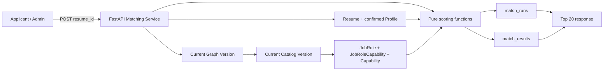

# Applicant 岗位推荐与人岗匹配设计

## 1. 目标

Batch H 交付 applicant 自助岗位推荐闭环：用户选择一份已有简历，系统读取该简历当前已确认的 Resume Profile，与当前正式发布目录中的全部标准 JobRole 同步计算匹配分，保存不可变的 Match Run 和全部岗位结果，并直接返回 Top 20。

本批解决以下问题：

1. 将已确认的简历画像转换为可重复、可解释的人岗匹配结果。
2. 同时考虑必备技能、加分技能、技能证据、工作经验和学历。
3. 使用固定版本算法，保证相同输入得到相同结果。
4. 保存本次使用的 Profile、正式图谱水位、目录版本、权重和岗位快照，使历史结果可追溯。
5. 为后续差距展示和成长路径生成提供稳定的缺失技能输入。

本批面向比赛展示和团队内部真实使用，不扩展为企业级招聘排序平台。

## 2. 已确认方案

### 2.1 匹配对象

只匹配系统当前正式发布目录中的标准 `JobRole`，不接受调用方提交任意 JD，不读取 HR 私有 JD，也不临时生成岗位要求。

### 2.2 匹配输入

`POST /api/v1/job-recommendations` 只接收 `resume_id`。后端自动确定：

- 该 Resume 当前唯一的 `confirmed` Resume Profile；
- 当前 `published + is_current` 的 Graph Version；
- 该 Graph Version 对应的 current published Catalog Version；
- 固定算法版本 `match_weights_v1`。

调用方不能覆盖 Profile ID、Graph Version、Catalog Version、权重、阈值或证据因子。

### 2.3 计算方式

匹配在 FastAPI 请求内同步完成，不创建 Celery Task，不创建 Processing Run，也不调用 LLM、算法服务或 Neo4j。

PostgreSQL 是本批所有匹配输入和结果的唯一真相源。

### 2.4 结果保存

每次成功匹配保存：

- 一个不可变 `match_runs` 记录；
- 本次参与计算的全部岗位对应的 `match_results`；
- 每个岗位的五维得分、匹配技能、缺失技能、岗位快照和最终排名。

POST 默认只返回前 20 条结果，但数据库保存全部结果。

### 2.5 自然幂等

以下三个值完全相同时复用已有成功 Match Run：

```text
resume_profile_id
+ graph_version_id
+ weight_version
```

Profile、正式图谱水位或权重版本任一变化时，创建新的 Match Run。

不额外要求 `Idempotency-Key`，数据库唯一约束就是本接口的幂等边界。

## 3. 技术边界



职责划分：

- Resume 模块继续负责简历、Profile 版本和技能映射事实。
- Catalog 模块继续负责 Domain、Capability、JobRole 和正式目录成员。
- Graph 模块继续负责发布水位与 Neo4j 展示投影。
- Matching 模块只负责选择固定输入、执行确定性评分、持久化和查询历史结果。
- Neo4j 不参与匹配计算；图数据库仍只承担图谱展示查询。
- LLM 不参与岗位排序；LLM 只存在于上游简历解析和未来成长路径场景。

## 4. 明确不实现

本批不实现：

- HR Recruitment Project、候选人批量排序或任意 JD 匹配；
- LLM 二次排序、语义相似度补分或向量检索；
- LangChain、LangGraph 或通用 Agent 编排；
- Celery 异步匹配或匹配进度轮询；
- Neo4j 匹配查询或 PostgreSQL/Neo4j 双读；
- 动态权重管理后台、用户自定义权重或 A/B 算法配置；
- 项目经验文本、学校名称、专业名称的语义评分；
- 技能熟练度和单项技能年限加权；
- 岗位过滤、收藏、投递、推荐理由 LLM 文案；
- 成长路径生成和课程推荐；
- 历史结果重算、修改或删除接口；
- Redis 缓存；
- 为匹配结果新增搜索引擎或分析仓库。

原因是当前比赛版首先需要一条稳定、可解释、可演示的人岗匹配闭环。上述能力只有在有真实业务数据证明需要时再增加。

## 5. 正式岗位集合的准确边界

### 5.1 Graph Version 的含义

当前 `GraphVersion.snapshot` 只包含一次岗位发布对应的单岗位快照。它不是全部正式岗位的完整快照。

`GraphVersion.status = published AND is_current = true` 表示最近一次成功发布的正式图谱水位。该记录的 `catalog_version_id` 指向同次发布形成的完整 Catalog Version。

因此：

```text
graph_version_id   = 本次匹配使用的正式图谱发布水位
catalog_version_id = 本次匹配实际使用的完整岗位与技能目录
```

### 5.2 当前版本查询

Matching Service 使用一个 PostgreSQL 查询同时取得 Graph Version 和 Catalog Version，要求：

```text
GraphVersion.status = published
GraphVersion.is_current = true
CatalogVersion.id = GraphVersion.catalog_version_id
CatalogVersion.status = published
CatalogVersion.is_current = true
```

如果 current Graph Version 不存在，返回 `GRAPH_VERSION_NOT_PUBLISHED`。

如果 Graph Version 存在但它指向的 Catalog Version 不存在、未发布或不是 current，返回 `MATCH_CATALOG_INCONSISTENT`，不退化读取其他目录。

### 5.3 岗位成员查询

参与匹配的岗位必须同时满足：

1. `CatalogVersionItem.catalog_version_id` 等于本次锁定的 Catalog Version；
2. `CatalogVersionItem.item_type = job_role`；
3. `CatalogVersionItem.job_role_id = JobRole.id`；
4. `JobRole.status = active`；
5. 岗位所属 `Domain.status = active`。

不直接使用 `SELECT JobRole WHERE status = active`，避免把尚未进入当前正式目录的岗位纳入结果。

### 5.4 技能关系查询

岗位技能必须同时满足：

1. 存在对应 `JobRoleCapability`；
2. `requirement_type` 为 `required` 或 `bonus`；
3. Capability 属于本次 Catalog Version 的 `CatalogVersionItem`；
4. Capability 和所属 Domain 均为 `active`；
5. `importance` 位于数据库现有约束 `0..1` 内。

岗位和 Capability 成员查询按 UUID 去重，避免目录成员重复行造成重复计分。

任何正式岗位没有至少一个有效必备技能，或必备技能 `importance` 总和不大于 0 时，整个匹配请求返回 `MATCH_CATALOG_INCONSISTENT`，不为该岗位制造默认满分，也不静默跳过岗位。岗位存在 bonus 技能但 bonus `importance` 总和不大于 0 时同样视为目录不一致。

如果当前目录没有任何正式岗位，返回 `MATCH_JOB_ROLE_NOT_AVAILABLE`。

### 5.5 为什么不读取 Neo4j

Neo4j 当前承担正式知识图谱的交互展示。匹配所需的 Profile、Capability UUID、JobRoleCapability importance、Catalog Version 和岗位定义均以 PostgreSQL 为主数据。

让匹配读取 Neo4j 会增加：

- 两个数据库之间的一致性窗口；
- 对 Neo4j 可用性的额外依赖；
- 无必要的 Cypher 查询和结果转换；
- 历史 Match Run 难以精确锚定 PostgreSQL Catalog Version 的问题。

因此本批不读取 Neo4j，也不实现 Neo4j 失败回退。

## 6. 岗位匹配策略字段

### 6.1 `match_policy`

在现有 `JobRole.definition_payload` 对应的 `RoleDefinitionPayload` 中增加可选结构：

```json
{
  "match_policy": {
    "minimum_education_level": "bachelor",
    "recommended_experience_months": 24
  }
}
```

字段定义：

| 字段 | 类型 | 允许值/限制 | 说明 |
| --- | --- | --- | --- |
| minimum_education_level | string/null | high_school、associate、bachelor、master、doctor | 最低建议学历 |
| recommended_experience_months | integer/null | 0-600 | 建议工作经验月数 |

`match_policy` 本身可缺省。两个子字段也可分别缺省。

不允许岗位要求使用 `other` 或 `unknown`，因为它们不能形成可排序的最低学历门槛。

### 6.2 历史数据兼容

现有 JobRole 没有 `match_policy` 时不执行数据回填：

```text
education_score = 100
education_status = not_required
experience_score = 100
experience_status = not_required
```

含义是岗位未声明学历或经验门槛，不因为岗位元数据缺失处罚 applicant。

`recommended_experience_months = 0` 与字段缺省相同，视为 `not_required`。

### 6.3 发布行为

Role Definition 经审核并发布时，`match_policy` 随完整 `definition_payload` 写入 JobRole 和 Graph Version 单岗位快照。

修改某个正式岗位的匹配策略必须经过后续岗位更新/重新发布流程，并产生新的正式 Graph Version。Matching Service 不提供绕过审核直接修改策略的接口。

## 7. 固定算法版本

### 7.1 权重

算法版本固定为：

```text
match_weights_v1
```

五个维度：

| 维度 | 权重 |
| --- | ---: |
| 必备技能覆盖率 | 55% |
| 加分技能覆盖率 | 10% |
| 技能证据质量 | 15% |
| 工作经验匹配 | 15% |
| 学历匹配 | 5% |

总分公式：

```text
total_score =
    required_skill_coverage * 0.55
  + bonus_skill_coverage    * 0.10
  + skill_evidence_quality  * 0.15
  + experience_score        * 0.15
  + education_score         * 0.05
```

所有维度分和总分范围均为 `0..100`。

### 7.2 证据因子

```text
mention = 0.40
project = 0.70
work    = 1.00
```

不使用 LLM 自报 `confidence` 参与匹配分。Profile 被确认后，confidence 只作为上游抽取元数据，不作为业务门槛。

### 7.3 版本化规则

权重、证据因子、阈值、学历等级、舍入规则或任何公式发生行为变化时，必须增加新的 `weight_version`，例如 `match_weights_v2`。

不能原地改变 `match_weights_v1` 的含义。

第一版不创建权重配置表，也不从环境变量读取权重。权重作为代码常量并完整复制到每个 Match Run 的 `weight_snapshot`。

## 8. Profile 技能输入规则

### 8.1 Profile 选择

只读取目标 Resume 当前状态为 `confirmed` 的唯一 Resume Profile。

以下 Profile 不参与匹配：

- candidate；
- draft；
- superseded；
- 属于其他 Resume 的 Profile。

不存在 confirmed Profile 时返回 `RESUME_PROFILE_NOT_CONFIRMED`。

Resume 已归档时返回 `RESUME_ARCHIVED`。

### 8.2 技能选择

只读取：

```text
ResumeSkill.profile_id = confirmed_profile.id
ResumeSkill.mapping_status = mapped
ResumeSkill.capability_id IS NOT NULL
```

Profile 内 `(profile_id, capability_id)` 已有唯一索引，因此同一标准 Capability 最多计分一次。

`unmapped` 技能保留在 Profile 中供用户查看，但不参与本批标准技能精确匹配，也不产生语义补分。

### 8.3 精确匹配

岗位技能和简历技能只按 `capability_id` 相等判断匹配：

```text
ResumeSkill.capability_id == JobRoleCapability.capability_id
```

Alias、大小写、分词和文本相似度已经属于上游技能映射问题，本批不再次解释文本。

### 8.4 没有已映射技能

confirmed Profile 可以没有 mapped Capability。此时请求仍成功：

- 必备技能覆盖率为 0；
- 有加分技能的岗位加分技能覆盖率为 0；
- 技能证据质量为 0；
- 经验和学历维度仍按 Profile 事实计算；
- 所有岗位仍被保存和排序。

这属于合法的低匹配场景，不视为系统错误。

## 9. 五维评分公式

### 9.1 必备技能覆盖率

```text
required_skill_coverage =
    sum(matched_required.importance)
    / sum(all_required.importance)
    * 100
```

输出状态固定为 `evaluated`。

正式岗位没有有效必备技能时属于目录不一致，不进入除法，不保存 Match Run。

### 9.2 加分技能覆盖率

岗位存在加分技能时：

```text
bonus_skill_coverage =
    sum(matched_bonus.importance)
    / sum(all_bonus.importance)
    * 100
```

状态为 `evaluated`。

岗位没有加分技能时：

```text
bonus_skill_coverage = 100
status = not_required
```

该维度作为中性满分处理，不动态重分配 10% 权重。

### 9.3 技能证据质量

证据质量只评价已经匹配上的岗位技能：

```text
skill_evidence_quality =
    sum(matched_capability.importance * evidence_factor)
    / sum(matched_capability.importance)
    * 100
```

计算范围同时包含已匹配的 required 和 bonus 技能。

不把缺失技能作为零证据放入分母，因为覆盖率维度已经处罚技能缺失，重复计入会造成双重扣分。

没有匹配到任何岗位技能时：

```text
skill_evidence_quality = 0
status = no_matched_skill
```

否则状态为 `evaluated`。

示例：

| 岗位技能 | requirement_type | importance | Profile 证据 | 因子 |
| --- | --- | ---: | --- | ---: |
| Python | required | 1.0 | work | 1.0 |
| PyTorch | required | 1.0 | project | 0.7 |
| Docker | bonus | 0.5 | mention | 0.4 |

```text
(1.0*1.0 + 1.0*0.7 + 0.5*0.4) / (1.0+1.0+0.5) * 100 = 76.00
```

### 9.4 工作经验匹配

岗位没有建议经验，或建议月数为 0：

```text
score = 100
status = not_required
```

岗位有建议经验，但 Profile 的 `total_experience_months` 为 null：

```text
score = 0
status = unknown
```

Profile 经验为 0：

```text
score = 0
status = unmet
```

Profile 经验小于岗位建议：

```text
score = candidate_months / recommended_months * 100
status = partial
```

Profile 经验达到或超过岗位建议：

```text
score = 100
status = satisfied
```

示例：岗位建议 24 个月，Profile 为 18 个月：

```text
18 / 24 * 100 = 75.00
```

### 9.5 学历匹配

固定学历等级：

```text
high_school = 1
associate   = 2
bachelor    = 3
master      = 4
doctor      = 5
```

岗位没有最低学历：

```text
score = 100
status = not_required
```

Profile 学历为 null、`other` 或 `unknown`：

```text
score = 0
status = unknown
```

Profile 学历达到或超过要求：

```text
score = 100
status = satisfied
```

Profile 学历低于要求：

```text
score = candidate_rank / minimum_rank * 100
status = partial
```

示例：岗位要求 bachelor，Profile 为 associate：

```text
2 / 3 * 100 = 66.67
```

### 9.6 舍入

内部计算使用 Python 标准库 `Decimal`，不使用二进制浮点作为最终业务分数。

规则：

1. 各维度先使用未舍入 Decimal 计算；
2. 总分使用未舍入维度值计算；
3. 持久化前统一使用 `ROUND_HALF_UP` 保留两位小数；
4. 匹配等级使用最终持久化的两位小数总分；
5. 排名比较使用持久化的两位小数总分和维度分。

## 10. 匹配等级与稳定排序

### 10.1 等级

```text
high   = total_score >= 75.00
medium = 50.00 <= total_score < 75.00
low    = total_score < 50.00
```

### 10.2 排序

全部岗位按以下顺序稳定排序：

```text
1. total_score 降序
2. required_skill_coverage 降序
3. skill_evidence_quality 降序
4. experience_score 降序
5. bonus_skill_coverage 降序
6. education_score 降序
7. JobRole.canonical_name.casefold() 升序
8. JobRole.id 字符串升序
```

排序完成后从 1 开始连续写入 `rank`。

不使用数据库默认顺序、创建时间、随机数或 LLM 进行同分排序。

## 11. 数据模型

新增 Alembic Revision `0011` 和两张表。

### 11.1 `match_runs`

用途：保存一次成功完成的、不可变的匹配输入水位和汇总。

| 字段 | 类型 | 空值 | 说明 |
| --- | --- | :---: | --- |
| id | uuid | 否 | PK |
| owner_user_id | uuid | 否 | FK users；Resume 所有者 |
| resume_id | uuid | 否 | FK resumes |
| resume_profile_id | uuid | 否 | FK resume_profiles；本次 confirmed Profile |
| graph_version_id | uuid | 否 | FK graph_versions；发布水位 |
| catalog_version_id | uuid | 否 | FK catalog_versions；完整目录 |
| weight_version | varchar(40) | 否 | 固定为 match_weights_v1 |
| weight_snapshot | jsonb | 否 | 权重、因子、阈值和舍入规则 |
| result_count | integer | 否 | 全部岗位结果数量 |
| high_count | integer | 否 | high 数量 |
| medium_count | integer | 否 | medium 数量 |
| low_count | integer | 否 | low 数量 |
| created_at | timestamptz | 否 | 完成并持久化时间 |

约束：

```sql
UNIQUE (resume_profile_id, graph_version_id, weight_version)
CHECK (result_count >= 0)
CHECK (high_count >= 0)
CHECK (medium_count >= 0)
CHECK (low_count >= 0)
CHECK (high_count + medium_count + low_count = result_count)
CHECK (jsonb_typeof(weight_snapshot) = 'object')
```

索引：

```text
(owner_user_id, created_at DESC)
(resume_id, created_at DESC)
```

不增加 `status`、`updated_at`、`completed_at` 或 `last_error`。匹配在单个数据库事务中同步完成；失败请求不创建 Match Run，因此已存在的 Run 都是完成态。

### 11.2 `match_results`

用途：保存一个 Match Run 下某个岗位的不可变结果。

| 字段 | 类型 | 空值 | 说明 |
| --- | --- | :---: | --- |
| match_run_id | uuid | 否 | FK match_runs，复合 PK |
| job_role_id | uuid | 否 | FK job_roles，复合 PK |
| rank | integer | 否 | Run 内从 1 开始的排名 |
| total_score | numeric(6,2) | 否 | 0-100 |
| match_level | varchar(20) | 否 | high、medium、low |
| dimension_scores | jsonb | 否 | 五维得分与解释数据 |
| matched_capabilities | jsonb | 否 | 已匹配 required/bonus 技能 |
| missing_capabilities | jsonb | 否 | 未匹配 required/bonus 技能 |
| gap_summary | jsonb | 否 | 列表页使用的数量汇总 |
| job_role_snapshot | jsonb | 否 | 岗位、Domain 和 definition_payload 快照 |
| created_at | timestamptz | 否 | 创建时间 |

约束：

```sql
PRIMARY KEY (match_run_id, job_role_id)
UNIQUE (match_run_id, rank)
CHECK (rank >= 1)
CHECK (total_score BETWEEN 0 AND 100)
CHECK (match_level IN ('high','medium','low'))
CHECK (jsonb_typeof(dimension_scores) = 'object')
CHECK (jsonb_typeof(matched_capabilities) = 'array')
CHECK (jsonb_typeof(missing_capabilities) = 'array')
CHECK (jsonb_typeof(gap_summary) = 'object')
CHECK (jsonb_typeof(job_role_snapshot) = 'object')
```

`match_run_id` 删除时可级联删除结果，但应用层不提供删除 Match Run 的接口。`job_role_id` 不级联删除，防止历史结果因主数据删除而丢失。

### 11.3 不创建额外表

本批不创建：

- `match_weights`；
- `match_dimension_results`；
- `match_capability_results`；
- `match_jobs`；
- `match_events`；
- `recommendation_feedback`。

五维结构固定且单次结果只用于整体读取，JSONB 已足够；拆成更多表会增加 join 和迁移复杂度，但不能提高当前展示价值。

## 12. 快照结构

### 12.1 `weight_snapshot`

示例：

```json
{
  "algorithm": "exact_capability_match_v1",
  "weights": {
    "required_skill_coverage": 0.55,
    "bonus_skill_coverage": 0.10,
    "skill_evidence_quality": 0.15,
    "experience": 0.15,
    "education": 0.05
  },
  "evidence_factors": {
    "mention": 0.40,
    "project": 0.70,
    "work": 1.00
  },
  "education_ranks": {
    "high_school": 1,
    "associate": 2,
    "bachelor": 3,
    "master": 4,
    "doctor": 5
  },
  "match_levels": {
    "high_minimum": 75.00,
    "medium_minimum": 50.00
  },
  "rounding": "ROUND_HALF_UP_2DP"
}
```

### 12.2 `dimension_scores`

示例：

```json
{
  "required_skill_coverage": {
    "score": 75.00,
    "status": "evaluated",
    "matched_count": 3,
    "total_count": 4,
    "matched_importance": 3.0,
    "total_importance": 4.0
  },
  "bonus_skill_coverage": {
    "score": 50.00,
    "status": "evaluated",
    "matched_count": 1,
    "total_count": 2,
    "matched_importance": 0.5,
    "total_importance": 1.0
  },
  "skill_evidence_quality": {
    "score": 82.86,
    "status": "evaluated",
    "matched_count": 4,
    "evidence_weighted_importance": 2.9,
    "matched_importance": 3.5
  },
  "experience": {
    "score": 75.00,
    "status": "partial",
    "candidate_months": 18,
    "recommended_months": 24
  },
  "education": {
    "score": 100.00,
    "status": "satisfied",
    "candidate_level": "master",
    "minimum_level": "bachelor"
  }
}
```

允许的状态：

| 维度 | 状态 |
| --- | --- |
| required_skill_coverage | evaluated |
| bonus_skill_coverage | evaluated、not_required |
| skill_evidence_quality | evaluated、no_matched_skill |
| experience | not_required、unknown、unmet、partial、satisfied |
| education | not_required、unknown、partial、satisfied |

### 12.3 `matched_capabilities`

按 `requirement_type`、importance 降序、Capability 名称和 UUID 稳定排序：

```json
[
  {
    "capability_id": "capability-uuid",
    "canonical_name": "Python",
    "requirement_type": "required",
    "importance": 1.0,
    "resume_skill": {
      "id": "resume-skill-uuid",
      "raw_name": "Python",
      "mapping_method": "canonical_exact",
      "evidence_strength": "work",
      "evidence_factor": 1.0,
      "evidence_quote": "负责 Python 数据处理服务开发"
    }
  }
]
```

保留 evidence quote 是为了让单岗位明细可以直接解释证据来源，不需要再次读取或解释原始文件。接口仍受 Resume 所有权保护。

### 12.4 `missing_capabilities`

```json
[
  {
    "capability_id": "capability-uuid",
    "canonical_name": "Kubernetes",
    "skill_type": "platform",
    "requirement_type": "required",
    "importance": 1.0,
    "domain": {
      "id": "domain-uuid",
      "code": "cloud-native",
      "name": "云原生"
    }
  }
]
```

required 和 bonus 缺失项都保存，并通过 `requirement_type` 区分。成长路径后续默认读取 required 缺失项；bonus 缺失项只作为进阶建议。

### 12.5 `gap_summary`

列表页只需要数量，不复制完整缺失数组：

```json
{
  "matched_required_count": 3,
  "missing_required_count": 1,
  "matched_bonus_count": 1,
  "missing_bonus_count": 1
}
```

### 12.6 `job_role_snapshot`

```json
{
  "id": "job-role-uuid",
  "canonical_name": "AI 应用工程师",
  "description": "负责大模型应用开发与工程化落地",
  "domain": {
    "id": "domain-uuid",
    "code": "ai",
    "name": "人工智能"
  },
  "definition_payload": {
    "role_name": "AI 应用工程师",
    "core_responsibilities": [],
    "required_capability_ids": [
      "11111111-1111-4111-8111-111111111111",
      "22222222-2222-4222-8222-222222222222"
    ],
    "bonus_capability_ids": [
      "33333333-3333-4333-8333-333333333333"
    ],
    "industry_scenarios": [],
    "match_policy": {
      "minimum_education_level": "bachelor",
      "recommended_experience_months": 24
    }
  }
}
```

历史接口展示岗位名称、说明和要求时读取该快照，不读取 JobRole 当前值覆盖历史结果。

## 13. 同步计算事务

### 13.1 主流程

```text
1. 校验当前身份：applicant 或 admin；hr 拒绝。
2. 按既有 Resume 权限规则读取并锁定 Resume 行。
3. 拒绝 archived Resume。
4. 查询当前 confirmed Resume Profile。
5. 查询 current published Graph Version 和对应 Catalog Version。
6. 按自然幂等键查询已有 Match Run。
7. 已存在则直接返回已有 Run 和 Top 20，reused=true。
8. 读取 Profile 的 mapped ResumeSkill。
9. 读取当前 Catalog 的全部正式岗位及岗位技能。
10. 验证岗位和技能目录完整性。
11. 在 Python 内执行纯确定性评分。
12. 稳定排序、分配 rank、统计 high/medium/low。
13. 在同一事务插入 MatchRun 和全部 MatchResult。
14. 写一条成功审计记录。
15. commit。
16. 返回 Run 摘要和 Top 20，reused=false。
```

### 13.2 为什么锁 Resume

现有 Profile 确认和 Resume 归档流程都会先锁定 Resume 行。匹配时复用同一行锁，可以防止请求在“选择 confirmed Profile”和“保存 Match Run”之间与新 Profile 确认或 Resume 归档交错。

锁定只持续一个同步匹配事务。当前岗位和技能规模适合内存计算，不引入分布式锁。

### 13.3 原子性

Match Run、全部 Match Result 和成功审计记录在一个事务中提交。

任一步失败时全部回滚：

- 不保留空 Run；
- 不保留部分岗位结果；
- 不把失败状态写进 `match_runs`；
- 不需要清理任务或补偿事务。

### 13.4 并发重复请求

两个相同输入请求可能同时通过首次存在性查询。数据库唯一约束负责最终仲裁：

```text
UNIQUE (resume_profile_id, graph_version_id, weight_version)
```

发生唯一约束竞争时，失败事务 rollback，然后读取胜出事务创建的完整 Match Run，作为 `reused=true` 返回。

不增加 Redis 锁、PostgreSQL advisory lock 或幂等键表。

### 13.5 发布并发

匹配开始时用一个查询确定 Graph Version 与 Catalog Version。即使随后管理员发布了新版本，本次请求仍继续使用已经选定的旧版本 ID，并在 Match Run 中明确保存。

新请求会看到新的 current Graph Version，因此创建新 Run。历史结果不会被覆盖。

## 14. API 设计

新增 Router 前缀：

```text
/api/v1/job-recommendations
```

### 14.1 创建或复用推荐结果

```http
POST /api/v1/job-recommendations
Content-Type: application/json
X-CSRF-Token: ...
```

请求：

```json
{
  "resume_id": "resume-uuid"
}
```

请求模型 `extra=forbid`。不接受其他字段。

响应状态固定为 `200 OK`，因为请求既可能新建，也可能复用已有 Run。

```json
{
  "data": {
    "reused": false,
    "run": {
      "id": "match-run-uuid",
      "owner_user_id": "user-uuid",
      "resume_id": "resume-uuid",
      "resume_profile": {
        "id": "profile-uuid",
        "version_no": 2
      },
      "graph_version": {
        "id": "graph-version-uuid",
        "version_no": 5
      },
      "catalog_version": {
        "id": "catalog-version-uuid",
        "version_no": 7
      },
      "weight_version": "match_weights_v1",
      "result_count": 42,
      "high_count": 6,
      "medium_count": 18,
      "low_count": 18,
      "created_at": "2026-08-07T10:00:00Z"
    },
    "results": {
      "items": [],
      "page": 1,
      "page_size": 20,
      "total": 42
    }
  }
}
```

POST 始终返回排名 1-20，不接受分页参数。

### 14.2 Match Run 历史列表

```http
GET /api/v1/job-recommendations?page=1&page_size=20&resume_id={optional}
```

参数：

| 参数 | 默认 | 限制 | 说明 |
| --- | ---: | ---: | --- |
| page | 1 | >=1 | 页码 |
| page_size | 20 | 1-100 | 每页数量 |
| resume_id | 无 | UUID | 可选，只查看某份 Resume |

排序：

```text
created_at DESC, id DESC
```

响应：

```json
{
  "data": {
    "items": [],
    "page": 1,
    "page_size": 20,
    "total": 3
  }
}
```

### 14.3 Match Run 结果分页

```http
GET /api/v1/job-recommendations/{match_run_id}?page=1&page_size=20
```

返回 Run 摘要和按 `rank ASC` 排序的结果页：

```json
{
  "data": {
    "run": {},
    "results": {
      "items": [],
      "page": 1,
      "page_size": 20,
      "total": 42
    }
  }
}
```

默认 page size 20，最大 100。

### 14.4 单岗位匹配明细

```http
GET /api/v1/job-recommendations/{match_run_id}/job-roles/{job_role_id}
```

返回：

```json
{
  "data": {
    "run": {},
    "result": {
      "job_role_id": "job-role-uuid",
      "rank": 1,
      "total_score": 86.25,
      "match_level": "high",
      "job_role": {},
      "dimension_scores": {},
      "gap_summary": {},
      "matched_capabilities": [],
      "missing_capabilities": [],
      "created_at": "2026-08-07T10:00:00Z"
    }
  }
}
```

### 14.5 列表结果形状

POST Top 20 和 GET 分页列表中的每个结果只返回：

- `job_role_id`；
- `rank`；
- `total_score`；
- `match_level`；
- JobRole 快照中的名称、描述和 Domain；
- `dimension_scores`；
- `gap_summary`；
- `created_at`。

列表不返回完整 `matched_capabilities` 和 `missing_capabilities`，避免一次列表响应重复携带大量技能明细。单岗位明细接口返回完整数组。

## 15. 权限

### 15.1 Applicant

- 可以为自己的 Resume 创建或复用 Match Run；
- 可以查看自己的 Match Run 历史；
- 可以查看自己的 Run 和单岗位明细；
- 不能通过 UUID 探测其他 applicant 的 Resume 或 Match Run。

### 15.2 Admin

- 可以为任意 applicant Resume 创建或复用 Match Run；
- 可以查看全部 Match Run；
- `resume_id` 过滤可用于运营排查；
- Run 的 `owner_user_id` 始终写 Resume 所有者，不写执行操作的 Admin；
- 实际操作人写入 Audit Log。

### 15.3 HR

HR 不能访问 applicant 自助 Resume 和 Job Recommendation 接口，返回：

```text
403 ROLE_NOT_ALLOWED
```

HR 批量候选匹配属于后续独立 Recruitment 模块，不能复用 applicant 私有 Resume 的接口绕过边界。

### 15.4 所有权隐藏

Applicant 请求不存在或不属于自己的 Resume、Match Run 或 Match Result 时统一返回 404，不区分“存在但无权访问”，避免 UUID 探测。

### 15.5 CSRF

- POST 创建/复用接口需要有效 `X-CSRF-Token`；
- 三个 GET 接口不需要 CSRF；
- 所有接口都要求有效登录 Session。

## 16. 错误处理

| HTTP | code | 场景 |
| ---: | --- | --- |
| 401 | 既有认证错误 | 未登录或 Session 无效 |
| 403 | ROLE_NOT_ALLOWED | HR 调用；不允许的角色 |
| 403 | CSRF_VALIDATION_FAILED | POST 缺少或使用错误 CSRF |
| 404 | RESOURCE_NOT_OWNED | Resume 不存在或 applicant 无权访问 |
| 404 | MATCH_RUN_NOT_FOUND | Run 不存在或不可见 |
| 404 | MATCH_RESULT_NOT_FOUND | Run 内不存在该岗位结果 |
| 404 | GRAPH_VERSION_NOT_PUBLISHED | 当前没有正式 Graph Version |
| 409 | RESUME_ARCHIVED | Resume 已归档 |
| 409 | RESUME_PROFILE_NOT_CONFIRMED | 没有当前 confirmed Profile |
| 409 | MATCH_JOB_ROLE_NOT_AVAILABLE | 当前 Catalog 没有正式岗位 |
| 503 | MATCH_CATALOG_INCONSISTENT | Graph/Catalog 水位不一致，或正式岗位缺少有效必备技能 |

错误响应继续使用项目统一结构：

```json
{
  "error": {
    "code": "RESUME_PROFILE_NOT_CONFIRMED",
    "message": "请先确认简历画像",
    "request_id": "request-id"
  }
}
```

不向客户端返回 SQL、表名、约束名、堆栈、Neo4j 信息、原始异常或其他用户数据。

## 17. 审计

新建 Match Run 成功后记录：

```text
action = job_recommendation.run.create
resource_type = match_run
resource_id = match_run.id
outcome = success
```

metadata：

```json
{
  "resume_id": "...",
  "resume_profile_id": "...",
  "graph_version_id": "...",
  "catalog_version_id": "...",
  "weight_version": "match_weights_v1",
  "result_count": 42
}
```

复用已有 Run 时记录：

```text
action = job_recommendation.run.reuse
```

不为每个 Match Result 写单独 Audit Log，避免一次请求产生几十或几百条无意义审计记录。

普通结果 GET 不单独审计；它与现有 Resume 详情读取保持一致。原始 extracted text 的高敏读取仍由 Resume 模块单独审计。

## 18. 性能边界

### 18.1 查询方式

一次匹配使用少量批量查询：

1. Resume + confirmed Profile；
2. current Graph/Catalog；
3. Profile mapped skills；
4. Catalog 正式岗位；
5. 全部岗位的 JobRoleCapability + Capability + Domain；
6. 已有 Match Run；
7. 批量插入 Run 和 Results。

不对每个岗位发单独 SQL，不产生 N+1 查询。

### 18.2 内存计算

先构造：

```text
resume_skills_by_capability_id
role_capabilities_by_job_role_id
```

每个岗位只遍历自己的技能集合。复杂度近似：

```text
O(Profile mapped skills + Catalog role-capability relations)
```

当前比赛展示规模下同步内存计算足够，不做分块任务和分布式计算。

### 18.3 Top 20 不限制持久化

Top 20 只控制响应大小，不控制计算或保存数量。所有岗位先完成评分和稳定排序，然后批量持久化。

### 18.4 暂不缓存

自然幂等 Run 已经承担结果缓存作用。同一输入直接读取数据库结果，不需要 Redis 再缓存一次。

## 19. 模块边界

预计新增：

```text
backend/app/matching/__init__.py
backend/app/matching/models.py
backend/app/matching/schemas.py
backend/app/matching/scoring.py
backend/app/matching/service.py
backend/app/matching/router.py
backend/alembic/versions/0011_create_match_tables.py
```

预计修改：

```text
backend/app/api/router.py
backend/app/reviews/schemas.py
README.md
```

测试按职责分为公式、数据库约束、服务和 API。Matching 模块不创建 `tasks.py`、`llm.py`、`neo4j.py`、Repository interface 或 Provider factory。

`scoring.py` 只包含无数据库依赖的纯计算函数和固定 `match_weights_v1` 常量；数据库查询、事务和权限保留在 `service.py`。

## 20. 测试方案

### 20.1 纯公式测试

至少覆盖：

1. 必备技能按 importance 加权；
2. 加分技能按 importance 加权；
3. 无 bonus 时为 100/not_required；
4. evidence 只使用已匹配技能；
5. mention/project/work 因子分别为 0.4/0.7/1.0；
6. 没有匹配技能时 evidence 为 0；
7. 经验未知、0、部分满足、刚好满足和超过要求；
8. 岗位未配置经验时为 100/not_required；
9. 学历未知、低于、等于和高于要求；
10. 岗位未配置学历时为 100/not_required；
11. Decimal ROUND_HALF_UP 两位小数；
12. 49.99、50.00、74.99、75.00 的等级边界；
13. 完整五维手算样例与总分精确一致；
14. 多个同分岗位按已确认 tie-break 顺序稳定排序。

### 20.2 数据库约束测试

至少覆盖：

1. 相同 Profile + Graph Version + weight version 不能重复；
2. 同一 Run 不能有重复 JobRole；
3. 同一 Run 不能有重复 rank；
4. rank 必须大于等于 1；
5. total score 必须在 0-100；
6. match level 只能是 high/medium/low；
7. JSONB object/array 形状约束；
8. high + medium + low 必须等于 result_count；
9. 有效 Match Run 和 Result 可以正常 flush，避免测试只证明数据库抛错。

### 20.3 Service 集成测试

至少覆盖：

1. 只选择当前 confirmed Profile；
2. archived Resume 被拒绝；
3. 无 confirmed Profile 被拒绝；
4. current Graph Version 精确锁定对应 Catalog Version；
5. 只读取当前 Catalog 成员；
6. inactive 或不属于当前 Catalog 的 Capability 不参与；
7. 当前 Catalog 无岗位时被拒绝；
8. 正式岗位无有效必备技能时整次回滚；
9. 无 mapped skill 时仍生成完整低匹配结果；
10. 保存所有岗位结果而不是只保存 Top 20；
11. 返回结果按 rank 稳定排序；
12. 相同三元组复用已有 Run；
13. 新 confirmed Profile 产生新 Run；
14. 新 Graph Version 产生新 Run；
15. 新 weight version 产生新 Run；
16. 失败时不保留部分 Run/Result；
17. 创建和复用分别写一条 Audit Log；
18. 整个路径不调用 Celery、LLM 或 Neo4j。

### 20.4 API 测试

至少覆盖：

1. Applicant 可以为自己的 Resume POST；
2. Applicant 不能访问他人的 Resume 或 Run；
3. Admin 可以处理任意 applicant Resume；
4. HR 全部返回 ROLE_NOT_ALLOWED；
5. POST 必须有 CSRF；
6. 请求体拒绝未知字段；
7. POST 新建返回 reused=false 和 Top 20；
8. POST 复用返回 reused=true；
9. Run 列表分页和 resume_id 过滤；
10. Run 结果页默认 20、最大 100；
11. 单岗位明细返回完整 matched/missing 数组；
12. 不可见资源统一返回 404；
13. 分页参数越界由 FastAPI 返回统一验证错误。

### 20.5 回归验证

实现完成后运行：

```text
目标 matching tests
backend 全量 pytest
全仓库 Ruff
Alembic upgrade head
Alembic downgrade 0010 后重新 upgrade head
docker compose config
API 容器构建
```

匹配准确率 90% 不能由合成单元测试证明。业务准确率必须使用人工标注的 Resume-JobRole 样本单独评估；本批不伪造准确率结论。

## 21. 验收标准

只有以下全部满足，本批才算完成：

1. Applicant 能为自己的未归档 Resume 创建推荐结果；
2. 系统只使用当前 confirmed Profile；
3. 系统只匹配当前正式 Catalog 的标准岗位；
4. 计算不依赖 Celery、LLM、算法服务或 Neo4j；
5. `match_weights_v1` 五维公式、证据因子和等级阈值与本文一致；
6. 学历和经验只软扣分，不淘汰岗位；
7. 未知学历/经验记 0 并标记 unknown；
8. 岗位未声明学历/经验时记 100 并标记 not_required；
9. 所有岗位结果都保存，POST 默认返回 Top 20；
10. 同一输入三元组复用已有 Run；
11. Profile、Graph Version 或权重版本变化时创建新 Run；
12. 历史结果使用岗位和权重快照，不随主数据展示变化；
13. Applicant 无法读取其他用户结果，HR 无法调用该模块，Admin 可运营排查；
14. 事务失败不留下空 Run 或部分结果；
15. 公式、约束、服务、权限和分页测试通过；
16. 全量现有测试和 Ruff 继续通过。

## 22. 后续扩展边界

### 22.1 成长路径

后续成长路径模块可以读取：

```text
match_run_id
+ job_role_id
+ missing_capabilities where requirement_type = required
```

再使用 RAG/LLM 生成学习路径。该模块必须把本批缺失技能作为事实锚点，不能反向修改 Match Result。

### 22.2 HR 批量匹配

HR 模块落地时应新增 Recruitment Project、Candidate Record 和 Job Requirement Snapshot。可以复用纯评分函数，但不能直接复用 applicant 私有 Resume 的权限接口。

### 22.3 算法服务

如果后续接入算法同学的模型，算法结果应作为新的、明确版本化的评分维度或独立 weight version 接入。不能在 `match_weights_v1` 内静默改变分数含义。

### 22.4 更丰富的证据

只有在标注数据证明有收益后，再考虑技能熟练度、单项年限、项目规模、教育专业或工作岗位相关性。新增维度必须更新算法版本、快照和评估集。
