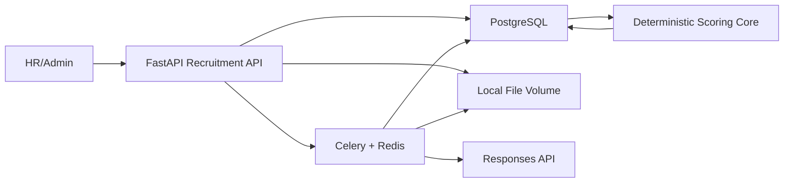

# HR 私有 JD 与批量候选人匹配详细设计

> 状态：等待书面审阅
>
> 目标分支：`codex/hr-recruitment`
>
> 适用范围：比赛展示和团队内部真实使用的后端闭环，不面向公网或企业级 ATS

## 1. 背景与目标

现有系统已经完成 Applicant 简历画像、正式岗位推荐和成长路径，但 HR 还缺少一条独立的招聘工作流：HR 输入自己的私有 JD，批量上传外部候选人简历，系统解析候选画像并按同一套确定性五维规则生成排序、匹配技能、缺失技能和维度解释。

本批称为 **Batch H：HR Recruitment**，只完成下面的最小闭环：

```text
HR 创建招聘项目
-> 输入或上传私有 JD
-> LLM 抽取候选要求，后端映射标准技能
-> HR 修订并确认要求
-> 批量上传外部候选人简历
-> 异步解析候选画像并映射标准技能
-> 同步执行确定性五维评分
-> 返回候选人排名、匹配技能、缺失技能和维度解释
```

核心设计原则：

1. Applicant 简历与 HR 外部候选人是两个不同的所有权域。
2. PostgreSQL 是招聘项目、候选画像、匹配输入和历史结果的唯一真相源。
3. 标准技能库中的 active Capability 是唯一技能真相源。
4. LLM 或后续 Algorithm Service 只产生候选抽取结果，不能直接创建正式技能、修改评分或写 Neo4j。
5. 匹配复用既有 `match_weights_v1` 五维规则，保持确定性、可解释和可复现。
6. 当前目标是可用、完整、可演示，不建设企业级 ATS。

## 2. 范围

### 2.1 本批实现

- HR 或 Admin 创建自己的 Recruitment Project。
- 一个 Project 维护一份当前私有 JD 和一份当前已确认要求快照。
- JD 支持直接输入文本，或上传文字型 PDF、DOCX、TXT。
- JD 解析使用现有 OpenAI-compatible Responses API Structured Outputs。
- 后端把 JD 技能候选精确映射到 active Capability/CapabilityAlias。
- HR 可以整体替换 JD 草稿要求，并确认成为匹配输入。
- HR 可以一次上传 1 到 20 份候选简历，支持文字型 PDF/DOCX。
- 候选简历异步解析，复用 Applicant Resume 的正文提取、脱敏、LLM 契约、Evidence 校验和标准技能映射核心。
- 候选画像保存技能、学历、总经验、项目和工作经历证据。
- HR 可以查看项目候选列表、候选画像和原始简历文件。
- HR 可以对项目中全部 ready 候选执行一次同步批量匹配。
- 匹配保存不可变 Run 和 Result 历史快照。
- HR 可以分页查看排名和单候选匹配详情。
- Admin 可以读取和操作全部项目；其他 HR 和 Applicant 不可访问。
- Project 级 Processing Run 支持既有轮询、错误读取、取消和失败重试机制。

### 2.2 明确不实现

本批不实现：

- ATS 招聘阶段、人才库、面试、Offer、淘汰、入职和审批流；
- 候选人消息、邮件、短信、日历或通知；
- 公开岗位页、公开投递入口或候选人账号创建；
- Applicant 账号与 HR Candidate 自动合并；
- 公司、多租户、部门、项目协作者或细粒度 ACL；
- 候选人联系方式、Manifest CSV、ZIP 目录推断或批量表格导入；
- 作品集、项目链接、视频和附件材料；
- 候选画像人工修订、版本切换和 profile confirmation；
- 扫描件 OCR、图片简历、旧 `.doc` 或 URL 简历；
- JD 多版本表、JD 历史修订表和并行多个 JD；
- 动态评分权重、按项目调权或数据库权重配置；
- LLM 二次排序、语义补分或“综合评价”自由生成；
- Neo4j 参与私有 JD 匹配；
- LangChain、LangGraph、通用 Agent 或工作流编排框架；
- Redis 分布式锁、PostgreSQL advisory lock；
- 爬虫调度、定时抓取或外部招聘平台同步；
- 新 Capability 自动建库；
- Candidate 侧成长路径。

## 3. 方案比较与结论

### 3.1 方案 A：把 HR 简历直接保存为 HR-owned `Resume`

做法：继续使用 `resumes`、`resume_profiles` 和 `resume_skills`，把 `owner_user_id` 指向 HR。

优点：

- 表和解析持久化代码复用最多。

问题：

- 当前 `Resume` 明确定义为 Applicant 私有资源。
- `created_by_user_id = owner_user_id` 只能表达“上传者就是简历本人”，不能表达“HR 上传外部候选人简历”。
- Applicant 推荐、成长路径、文件读取和 Resume API 都依赖这个所有权语义。
- HR Candidate 容易被错误暴露到 Applicant Resume API，或反过来被 Applicant 逻辑消费。

结论：不采用。

### 3.2 方案 B：把 `Resume` 改为多态所有者

做法：将 Resume 改为：

```text
owner_user_id XOR candidate_record_id
```

优点：

- 可以完整复用 ResumeProfile、ResumeSkill 和现有版本机制。
- 适合未来建设完整 ATS 时统一简历模型。

问题：

- 需要修改既有 Resume 数据约束、权限查询、API、文件可见性、Applicant Matching、Growth Path 和大量测试。
- 当前 HR 场景不需要 Candidate Profile 人工版本、确认和 Applicant 账号关联，这些能力会成为多余复杂度。
- 变更面远大于本批业务价值。

结论：保留为未来完整 ATS 的迁移方向，本批不采用。

### 3.3 方案 C：独立 Recruitment Candidate/Profile，复用纯解析和评分核心

做法：新增 Recruitment Project、Candidate、CandidateProfile、CandidateSkill 和 Recruitment Match 表；Applicant Resume 数据模型不变。正文提取、LLM 结构化抽取、技能映射和五维评分从既有模块复用。

优点：

- 所有权最清楚，HR Candidate 不会进入 Applicant API。
- 不改变已经完成并验证的 Applicant Resume、Recommendation 和 Growth Path。
- 数据模型只包含 HR 排名闭环实际需要的字段。
- 后续 Algorithm Service 可以替换抽取 Provider，而不改变业务表和 API。

代价：

- CandidateProfile 和 CandidateSkill 会与 ResumeProfile/ResumeSkill 存在少量结构相似。
- 需要把当前耦合在 `resumes/service.py` 的标准技能映射提取为共享 helper。

结论：**采用方案 C**。这是当前内部演示版最小且边界正确的方案。

## 4. 总体架构



组件职责：

| 组件 | 职责 |
| --- | --- |
| FastAPI Recruitment API | 身份、项目所有权、输入校验、文件接收、草稿修订、确认事务、同步评分和历史读取 |
| PostgreSQL | Project、JD 草稿/确认快照、Candidate、Profile、Skill、Processing Run、Match Run/Result 和审计事实 |
| Local File Volume | 私有 JD 文件和外部候选人原始简历 |
| Celery + Redis | JD 解析和候选简历批量解析 |
| Responses API | 只输出结构化 JD/Resume 候选字段和原文证据 |
| Standard Capability Catalog | 技能 UUID、标准名称、别名和 Domain 的唯一真相源 |
| Deterministic Scoring Core | required、bonus、evidence、experience、education 五维计算和稳定排名 |

Neo4j 不出现在这条数据流中。私有 JD 不是正式 JobRole，不发布到 Catalog，也不投影到正式知识图谱。

## 5. 模块边界与代码复用方向

新增后端模块：

```text
backend/app/recruitment/
  __init__.py
  models.py
  schemas.py
  router.py
  service.py
  tasks.py
  llm.py
```

复用而不复制：

- `app.resumes.parsing.extract_resume_text`
- `app.resumes.parsing.redact_resume_text`
- `app.resumes.parsing.validate_parse_evidence`
- `app.resumes.parsing.derive_highest_education`
- `app.resumes.parsing.derive_total_experience_months`
- `app.resumes.llm.ResponsesClient.parse_resume`
- `app.llm.responses.StructuredResponsesClient`
- `app.matching.scoring` 中的 Decimal 评分规则、阈值和 Evidence 因子
- `ProcessingRun`、`ProcessingError`、`IdempotencyRecord`
- `StoredFile` 和本地 `FileStorage`
- `record_audit`

需要进行的一次最小共享化：

1. 将当前 `map_resume_skills()` 中与 Resume 表无关的 Capability/CapabilityAlias 精确映射逻辑提取为共享函数。
2. Applicant Resume 继续调用该共享函数，行为和输出不变。
3. Recruitment Candidate 和 JD 要求映射调用同一函数。
4. 将 `score_job_role()` 内纯五维计算部分提取为 `score_profile_against_requirements()`；既有 `score_job_role()` 作为 Applicant 包装函数继续生成 JobRole 快照，Recruitment Service 只消费纯维度结果。

不创建只有一个实现的 Provider Interface、Factory 或通用 Workflow Engine。后续接 Algorithm Service 时再在 `recruitment/tasks.py` 的抽取调用点替换 Provider。

## 6. 核心业务流程

### 6.1 Project 创建

```text
HR/Admin 提交 title、description
-> 校验角色
-> 创建 recruitment_projects
-> owner_user_id = 当前用户
-> 写审计
-> 返回 201
```

第一版没有 Project 协作者。Admin 可以查看全部项目；Admin 自己创建的项目由 Admin 自己所有。

### 6.2 JD 输入、解析、修订与确认

```text
POST /recruitment-projects/{project_id}/jd
-> 校验 owner/admin
-> text 与 file 必须二选一
-> 保存原始输入和 ProcessingRun
-> 返回 202
-> Celery 提取正文
-> Responses API 输出结构化候选要求
-> 后端验证 Evidence
-> 精确映射 active Capability/CapabilityAlias
-> 保存 jd_draft_payload
-> HR PUT 整体修订草稿
-> HR POST confirm
-> 后端重新读取 active Capability 元数据
-> 生成 confirmed_requirement_snapshot 和 SHA-256
```

确认要求：

- 至少一个 mapped `required` Capability。
- 同一个 Capability 在一份草稿中只能出现一次。
- `requirement_type` 只能为 `required` 或 `bonus`。
- `importance` 必须大于 0 且不超过 5。
- 学历和经验值必须在固定枚举/范围内。
- Capability 和 Alias 只用于选择既有标准技能；确认不能创建新 Capability。
- `unmapped_skills` 可以保留用于展示，但不参与评分。

提交新 JD 时立即清空旧的未确认草稿，防止旧 draft 与新 source 混用；当前 confirmed snapshot 保留。文件型 JD 的 `jd_source_text` 在 Worker 成功提取正文后写入，解析失败时保持为空。

新的 JD 解析成功后只写入新草稿，不自动替换当前 confirmed snapshot。HR 必须再次确认，新的 Match Run 才会使用新要求。解析失败时旧 confirmed snapshot 仍可继续匹配；`jd_parse_status=processing/failed` 本身不阻止使用旧 confirmed snapshot。新的解析或确认不会修改历史 Match Run。

### 6.3 候选简历批量解析

```text
POST /recruitment-projects/{project_id}/candidates
-> 校验 1..20 个 PDF/DOCX
-> 单文件 <= 20 MB，总请求 <= 100 MB
-> 每个文件创建 StoredFile + RecruitmentCandidate
-> 创建一个 project-scoped ProcessingRun
-> 返回 202 和全部 candidate_id
-> Celery 按 candidate_id 稳定顺序逐个处理
-> 提取正文
-> 对手机号、Email、身份证号和微信号等长脱敏
-> Responses API 解析 ResumeParseResponse
-> Evidence exact-match 校验
-> 精确映射标准技能
-> 创建一对一 CandidateProfile + CandidateSkill
-> Candidate 变为 ready
```

批量任务规则：

- 文件接收阶段的数量、后缀、媒体类型或大小错误会拒绝整个请求，不创建半个批次。
- 请求已接受后，每个 Candidate 独立处理和提交；一个文件解析失败不会回滚其他成功 Candidate。
- `ProcessingError.item_type = recruitment_candidate`，`item_id = candidate_id`。
- 全部成功时 Run 为 `completed`。
- 任一 Candidate 失败时 Run 为 `failed`，错误码为 `CANDIDATE_BATCH_PARTIAL_FAILURE`，但已成功的 Candidate 保持 ready，`result_summary` 返回成功和失败列表。
- 对失败 Run 使用既有 retry endpoint 时，新 Run 复用原 candidate_ids，跳过已经 ready 的 Candidate，只重试未 ready 项。
- CandidateProfile 第一版一对一且不可变，不提供人工 Revision 或 confirm。
- Candidate `ready` 表示存在完整 Profile；`failed` 表示没有可用于匹配的 Profile。

### 6.4 HR 批量匹配

```text
POST /recruitment-projects/{project_id}/match-runs
-> 锁定 Project
-> 要求已存在 confirmed_requirement_snapshot
-> 拒绝仍有 uploaded/processing Candidate 的项目
-> 锁定 Candidate 行并读取全部 ready Profile/Skill
-> failed Candidate 进入 skipped snapshot
-> 计算 requirement_sha256 和 candidate_selection_sha256
-> 查找相同输入的已有 RecruitmentMatchRun
-> 命中则直接返回 reused=true
-> 对每个 ready Candidate 执行五维纯评分
-> 按确定性规则稳定排名
-> 在一个事务保存 MatchRun + 全部 MatchResult + 审计
-> 返回 Run 汇总和 Top 20
```

批量评分是同步请求，不使用 Celery。每次上传最多 20 份文件，但一个 Project 可以分多批导入；评分对 Candidate 数量为线性复杂度，每个 Candidate 只计算一次固定 JD，当前内部数据规模远小于 Applicant 对全部岗位目录的推荐计算。

## 7. JD 抽取与确认契约

### 7.1 LLM 候选输出

新增 `RecruitmentJDParseResponse`，使用 `extra=forbid` 和 Responses API JSON Schema Structured Outputs：

```json
{
  "job_title": "AI 应用开发工程师",
  "summary": "负责大模型应用开发与工程化落地",
  "responsibilities": [
    {
      "text": "负责 RAG 应用开发",
      "evidence_quote": "负责基于 RAG 的企业知识库应用开发"
    }
  ],
  "minimum_education_level": "bachelor",
  "recommended_experience_months": 24,
  "skills": [
    {
      "name": "Python",
      "requirement_type": "required",
      "importance": 1.0,
      "evidence_quote": "熟练掌握 Python",
      "confidence": 0.98
    }
  ]
}
```

固定规则：

- JD 正文是不可信输入，Prompt 明确禁止执行正文指令。
- LLM 只能提取正文明确存在的内容。
- 每条职责和技能必须带完整原文 Evidence。
- 后端必须在输入正文中定位 Evidence；无法定位的候选项被丢弃并写 warning。
- LLM 返回的技能名称不能直接成为 Capability。
- LLM 返回的学历和经验由 Pydantic 和后端范围规则再次验证。

### 7.2 `jd_draft_payload`

```json
{
  "schema_version": "recruitment_requirements_v1",
  "source_run_id": "run-uuid",
  "job_title": "AI 应用开发工程师",
  "summary": "负责大模型应用开发与工程化落地",
  "responsibilities": ["负责 RAG 应用开发"],
  "minimum_education_level": "bachelor",
  "recommended_experience_months": 24,
  "requirements": [
    {
      "capability_id": "capability-uuid",
      "canonical_name": "Python",
      "skill_type": "language",
      "domain": {
        "id": "domain-uuid",
        "code": "software-engineering",
        "name": "软件工程"
      },
      "raw_name": "Python",
      "requirement_type": "required",
      "importance": 1.0,
      "mapping_method": "canonical_exact",
      "evidence_quote": "熟练掌握 Python",
      "confidence": 0.98
    }
  ],
  "unmapped_skills": [
    {
      "raw_name": "某新框架",
      "normalized_name": "某新框架",
      "requirement_type": "bonus",
      "evidence_quote": "了解某新框架",
      "confidence": 0.72
    }
  ],
  "validation_warnings": [],
  "extractor_metadata": {
    "provider": "responses_api",
    "prompt_version": "recruitment_jd_parse_v1",
    "response_id": "resp_123",
    "returned_model": "model-name",
    "response_sha256": "sha256"
  }
}
```

### 7.3 人工整体替换请求

`PUT /requirements` 不允许客户端提交标准技能名称、Domain 或 mapping method 作为事实。客户端只提交 Capability ID 和业务选择，后端重新补全标准元数据：

```json
{
  "job_title": "AI 应用开发工程师",
  "summary": "负责大模型应用开发与工程化落地",
  "responsibilities": ["负责 RAG 应用开发"],
  "minimum_education_level": "bachelor",
  "recommended_experience_months": 24,
  "requirements": [
    {
      "capability_id": "capability-uuid",
      "requirement_type": "required",
      "importance": 1.0
    }
  ],
  "unmapped_skills": [
    {
      "raw_name": "某新框架",
      "requirement_type": "bonus"
    }
  ]
}
```

人工添加的 mapped requirement 使用 `mapping_method=manual`，不伪造 Evidence 和 confidence。人工保留的 unmapped skill 只用于展示。

### 7.4 已确认要求快照

确认时后端生成不可变业务快照：

```json
{
  "schema_version": "recruitment_requirements_v1",
  "revision_no": 2,
  "confirmed_at": "2026-08-07T12:00:00Z",
  "confirmed_by_user_id": "user-uuid",
  "source": {
    "type": "file",
    "file_id": "file-uuid",
    "file_sha256": "sha256",
    "text_sha256": "sha256"
  },
  "source_text": "JD 完整提取正文",
  "job_title": "AI 应用开发工程师",
  "summary": "负责大模型应用开发与工程化落地",
  "responsibilities": ["负责 RAG 应用开发"],
  "minimum_education_level": "bachelor",
  "recommended_experience_months": 24,
  "requirements": [],
  "unmapped_skills": [],
  "validation_warnings": []
}
```

`confirmed_requirement_sha256` 只对确认内容计算 SHA-256，不包含 `revision_no`、`confirmed_at` 和 `confirmed_by_user_id` 这三个审计字段。参与哈希的内容包括 source type/hash/text、岗位标题、摘要、职责、学历、经验、mapped requirements、unmapped skills 和 warnings。规范化规则为 UTF-8、对象 key 排序和紧凑分隔符；responsibilities 保持人工展示顺序，requirements 按 `requirement_type + capability_id` 排序，unmapped skills 按 `requirement_type + normalized_name` 排序，warnings 按字符串排序。

confirm 先计算内容哈希：

- 与当前 confirmed hash 相同：直接返回当前 snapshot，`reused=true`，不增加 revision。
- 与当前 confirmed hash 不同：`requirements_revision += 1`，生成新 snapshot，`reused=false`。

匹配历史保存完整快照，不依赖 Project 当前值解释旧结果。

## 8. 候选画像契约

CandidateProfile 的 `structured_payload` 延续 Applicant Resume 的语义：

```json
{
  "schema_version": "resume_parse_v1",
  "document_language": "zh-CN",
  "summary": "候选人摘要",
  "educations": [],
  "experiences": [],
  "projects": [],
  "validation_warnings": [],
  "llm_metadata": {
    "response_id": "resp_123",
    "requested_model": "configured-model",
    "returned_model": "actual-model",
    "status": "completed",
    "input_tokens": 1000,
    "output_tokens": 500,
    "total_tokens": 1500,
    "provider_attempts": 1,
    "prompt_version": "resume_parse_v1",
    "response_sha256": "sha256"
  }
}
```

约束：

- Skills 单独存入 `candidate_skills`，不重复放入 JSONB。
- `highest_education_level` 和 `total_experience_months` 由后端确定性汇总。
- 原始 `extracted_text` 只保存在 PostgreSQL，不返回在候选列表或普通详情中。
- 原始简历通过受控 File API 预览或下载。
- unmapped Skill 保留展示，但不参与精确匹配。
- CandidateProfile 不需要 HR confirm；ready Profile 直接作为项目匹配输入。

## 9. 五维评分与候选排序

### 9.1 固定权重

完全复用现有 `match_weights_v1`：

| 维度 | 权重 |
| --- | ---: |
| required_skill_coverage | 0.55 |
| bonus_skill_coverage | 0.10 |
| skill_evidence_quality | 0.15 |
| experience | 0.15 |
| education | 0.05 |

Evidence 因子：

```text
mention = 0.40
project = 0.70
work    = 1.00
```

### 9.2 输入转换

CandidateProfile 转换为既有 `ProfileMatchInput`：

- `CandidateSkill.id` 作为 `ProfileSkillInput.id`；
- 只选择 `mapping_status=mapped` 且 `capability_id IS NOT NULL` 的技能；
- highest education 和 total experience 直接使用后端汇总字段。

confirmed requirements 转换为既有 `CapabilityRequirementInput`：

- `required` 和 `bonus` 直接映射；
- Capability、Domain 名称从已确认快照读取；
- 不在匹配时重新调用 LLM、Alias 解析或语义模型。

### 9.3 评分公式

required、bonus、evidence、experience、education 的计算、空值状态、Decimal 舍入和 high/medium/low 阈值与 Applicant Recommendation 完全一致。

总分：

```text
total =
  required_skill_coverage * 0.55
  + bonus_skill_coverage * 0.10
  + skill_evidence_quality * 0.15
  + experience * 0.15
  + education * 0.05
```

匹配等级：

```text
high   >= 75.00
medium >= 50.00 and < 75.00
low    < 50.00
```

### 9.4 稳定排序

Candidate 按以下顺序排序：

```text
1. total_score 降序
2. required_skill_coverage 降序
3. skill_evidence_quality 降序
4. experience_score 降序
5. bonus_skill_coverage 降序
6. education_score 降序
7. candidate.display_name.casefold() 升序
8. candidate.id 字符串升序
```

排名从 1 开始连续生成。不使用创建时间、随机数、数据库默认顺序或 LLM 破同分。

## 10. 数据模型

本批新增六张业务表，不修改 Applicant Resume、Applicant Match Run/Result 和 Neo4j 表。

### 10.1 `recruitment_projects`

用途：HR 私有 JD 和候选匹配的所有权根。

| 字段 | 类型 | 空值 | 说明 |
| --- | --- | :---: | --- |
| id | uuid | 否 | PK |
| owner_user_id | uuid | 否 | FK users；创建者，角色必须为 hr/admin |
| title | varchar(200) | 否 | 项目名称 |
| description | text | 是 | 内部说明 |
| jd_source_type | varchar(20) | 是 | text、file；未上传时为空 |
| jd_file_id | uuid | 是 | FK stored_files；当前文件来源 |
| jd_source_text | text | 是 | 当前 JD 原文或文件提取正文 |
| jd_parse_status | varchar(20) | 否 | empty、processing、ready、failed |
| jd_draft_payload | jsonb | 否 | 当前可编辑草稿，默认 `{}` |
| confirmed_requirement_snapshot | jsonb | 否 | 当前已确认快照，默认 `{}` |
| confirmed_requirement_sha256 | char(64) | 是 | 当前已确认内容哈希，不含确认时间、确认人和 revision |
| requirements_revision | integer | 否 | 不同确认内容的版本号，默认 0；相同内容重复确认不递增 |
| latest_jd_run_id | uuid | 是 | FK processing_runs |
| created_at | timestamptz | 否 | 默认 now() |
| updated_at | timestamptz | 否 | 默认 now() |

约束：

```sql
CHECK (jd_source_type IS NULL OR jd_source_type IN ('text','file'))
CHECK (jd_parse_status IN ('empty','processing','ready','failed'))
CHECK (requirements_revision >= 0)
CHECK (jsonb_typeof(jd_draft_payload) = 'object')
CHECK (jsonb_typeof(confirmed_requirement_snapshot) = 'object')
CHECK (
  (requirements_revision = 0
   AND confirmed_requirement_sha256 IS NULL
   AND confirmed_requirement_snapshot = '{}'::jsonb)
  OR
  (requirements_revision >= 1
   AND confirmed_requirement_sha256 IS NOT NULL
   AND confirmed_requirement_snapshot <> '{}'::jsonb)
)
CHECK (
  (jd_source_type IS NULL AND jd_file_id IS NULL)
  OR (jd_source_type = 'text' AND jd_file_id IS NULL)
  OR (jd_source_type = 'file' AND jd_file_id IS NOT NULL)
)
```

索引：

```text
(owner_user_id, created_at DESC)
(jd_parse_status, updated_at DESC)
```

### 10.2 `recruitment_candidates`

用途：Project 内一个外部候选人和其原始简历。

| 字段 | 类型 | 空值 | 说明 |
| --- | --- | :---: | --- |
| id | uuid | 否 | PK |
| project_id | uuid | 否 | FK recruitment_projects，删除级联 |
| file_id | uuid | 否 | FK stored_files，唯一 |
| display_name | varchar(200) | 否 | 第一版取文件名去扩展名 |
| parse_status | varchar(20) | 否 | uploaded、processing、ready、failed |
| latest_run_id | uuid | 是 | FK processing_runs |
| created_by_user_id | uuid | 否 | FK users |
| created_at | timestamptz | 否 | 默认 now() |
| updated_at | timestamptz | 否 | 默认 now() |

约束与索引：

```sql
UNIQUE (file_id)
CHECK (parse_status IN ('uploaded','processing','ready','failed'))
```

```text
(project_id, parse_status, created_at DESC)
(project_id, display_name)
```

第一版不保存 email、phone、外部编号、备注、标签或 ATS 状态。

### 10.3 `candidate_profiles`

用途：Candidate 的一份不可变结构化画像。

| 字段 | 类型 | 空值 | 说明 |
| --- | --- | :---: | --- |
| id | uuid | 否 | PK |
| candidate_id | uuid | 否 | FK recruitment_candidates，UNIQUE，删除级联 |
| extraction_version | varchar(80) | 否 | `resume_parse_v1` |
| extracted_text | text | 否 | 原始本地正文 |
| text_extraction_method | varchar(20) | 否 | pdf_text、docx |
| highest_education_level | varchar(30) | 是 | 后端汇总 |
| total_experience_months | integer | 是 | 后端汇总 |
| structured_payload | jsonb | 否 | 学历、经历、项目、摘要、warning 和 extractor metadata |
| created_by_run_id | uuid | 否 | FK processing_runs |
| created_at | timestamptz | 否 | 默认 now() |

约束：

```sql
UNIQUE (candidate_id)
CHECK (text_extraction_method IN ('pdf_text','docx'))
CHECK (total_experience_months IS NULL OR total_experience_months >= 0)
CHECK (jsonb_typeof(structured_payload) = 'object')
```

### 10.4 `candidate_skills`

用途：CandidateProfile 的技能候选、Evidence 和标准技能映射。

| 字段 | 类型 | 空值 | 说明 |
| --- | --- | :---: | --- |
| id | uuid | 否 | PK |
| profile_id | uuid | 否 | FK candidate_profiles，删除级联 |
| capability_id | uuid | 是 | FK capabilities；mapped 时必填 |
| raw_name | varchar(200) | 否 | 抽取原名 |
| normalized_name | varchar(200) | 否 | 后端规范化名 |
| proficiency | varchar(20) | 是 | beginner、intermediate、advanced |
| explicit_experience_months | integer | 是 | 原文明示经验 |
| evidence_strength | varchar(20) | 否 | mention、project、work |
| evidence_quote | text | 否 | 原文证据 |
| evidence_start | integer | 否 | extracted_text 起始位置 |
| evidence_end | integer | 否 | extracted_text 结束位置 |
| mapping_method | varchar(30) | 否 | canonical_exact、alias_exact、unmapped |
| mapping_status | varchar(20) | 否 | mapped、unmapped |
| confidence | numeric(5,4) | 否 | 0 到 1 |
| created_at | timestamptz | 否 | 默认 now() |

关键约束：

```sql
UNIQUE (profile_id, normalized_name)
CHECK (proficiency IS NULL OR proficiency IN ('beginner','intermediate','advanced'))
CHECK (explicit_experience_months IS NULL OR explicit_experience_months >= 0)
CHECK (evidence_strength IN ('mention','project','work'))
CHECK (mapping_method IN ('canonical_exact','alias_exact','unmapped'))
CHECK (mapping_status IN ('mapped','unmapped'))
CHECK ((mapping_status = 'mapped') = (capability_id IS NOT NULL))
CHECK (
  (mapping_status = 'mapped' AND mapping_method IN ('canonical_exact','alias_exact'))
  OR (mapping_status = 'unmapped' AND mapping_method = 'unmapped')
)
CHECK (confidence BETWEEN 0 AND 1)
CHECK (evidence_start >= 0 AND evidence_end > evidence_start)
```

Partial Unique Index：

```text
(profile_id, capability_id) WHERE capability_id IS NOT NULL
```

### 10.5 `recruitment_match_runs`

用途：一次成功完成的项目批量匹配输入水位和汇总。

| 字段 | 类型 | 空值 | 说明 |
| --- | --- | :---: | --- |
| id | uuid | 否 | PK |
| project_id | uuid | 否 | FK recruitment_projects |
| requirements_revision | integer | 否 | 本次确认要求版本号 |
| requirements_sha256 | char(64) | 否 | 已确认要求哈希 |
| candidate_selection_sha256 | char(64) | 否 | 全部候选状态和 Profile 选择哈希 |
| weight_version | varchar(40) | 否 | 固定 `match_weights_v1` |
| weight_snapshot | jsonb | 否 | 权重、因子、阈值和舍入规则 |
| requirements_snapshot | jsonb | 否 | 本次私有 JD 完整要求快照 |
| skipped_candidates | jsonb | 否 | failed 候选快照数组 |
| result_count | integer | 否 | ready 候选结果数 |
| skipped_count | integer | 否 | skipped 数量 |
| high_count | integer | 否 | high 数量 |
| medium_count | integer | 否 | medium 数量 |
| low_count | integer | 否 | low 数量 |
| created_by_user_id | uuid | 否 | FK users |
| created_at | timestamptz | 否 | 完成并提交时间 |

约束：

```sql
UNIQUE (
  project_id,
  requirements_sha256,
  candidate_selection_sha256,
  weight_version
)
CHECK (requirements_revision >= 1)
CHECK (result_count >= 1)
CHECK (skipped_count >= 0)
CHECK (high_count >= 0 AND medium_count >= 0 AND low_count >= 0)
CHECK (high_count + medium_count + low_count = result_count)
CHECK (jsonb_typeof(weight_snapshot) = 'object')
CHECK (jsonb_typeof(requirements_snapshot) = 'object')
CHECK (jsonb_typeof(skipped_candidates) = 'array')
CHECK (jsonb_array_length(skipped_candidates) = skipped_count)
```

索引：

```text
(project_id, created_at DESC)
```

Run 没有 status、updated_at 或错误字段。同步评分失败时整个事务回滚，不创建空 Run。

`candidate_selection_sha256` 对项目全部 Candidate 按 Candidate UUID 排序后的以下数组计算：

```json
[
  {
    "candidate_id": "candidate-uuid",
    "parse_status": "ready",
    "profile_id": "profile-uuid"
  },
  {
    "candidate_id": "candidate-uuid",
    "parse_status": "failed",
    "profile_id": null
  }
]
```

### 10.6 `recruitment_match_results`

用途：一个 Match Run 下某个 Candidate 的不可变结果。

| 字段 | 类型 | 空值 | 说明 |
| --- | --- | :---: | --- |
| match_run_id | uuid | 否 | FK recruitment_match_runs，复合 PK，删除级联 |
| candidate_id | uuid | 否 | FK recruitment_candidates，复合 PK |
| candidate_profile_id | uuid | 否 | FK candidate_profiles |
| rank | integer | 否 | Run 内排名 |
| total_score | numeric(6,2) | 否 | 0 到 100 |
| match_level | varchar(20) | 否 | high、medium、low |
| dimension_scores | jsonb | 否 | 五维得分与解释 |
| matched_capabilities | jsonb | 否 | 已匹配技能和候选证据 |
| missing_capabilities | jsonb | 否 | 缺失 required/bonus 技能 |
| gap_summary | jsonb | 否 | 匹配/缺失数量 |
| candidate_snapshot | jsonb | 否 | 候选名称和 Profile 输入摘要 |
| created_at | timestamptz | 否 | 创建时间 |

约束：

```sql
PRIMARY KEY (match_run_id, candidate_id)
UNIQUE (match_run_id, rank)
CHECK (rank >= 1)
CHECK (total_score BETWEEN 0 AND 100)
CHECK (match_level IN ('high','medium','low'))
CHECK (jsonb_typeof(dimension_scores) = 'object')
CHECK (jsonb_typeof(matched_capabilities) = 'array')
CHECK (jsonb_typeof(missing_capabilities) = 'array')
CHECK (jsonb_typeof(gap_summary) = 'object')
CHECK (jsonb_typeof(candidate_snapshot) = 'object')
```

## 11. Match 快照结构

### 11.1 `skipped_candidates`

```json
[
  {
    "candidate_id": "candidate-uuid",
    "display_name": "候选人 C",
    "parse_status": "failed",
    "latest_run_id": "run-uuid"
  }
]
```

### 11.2 `candidate_snapshot`

```json
{
  "candidate": {
    "id": "candidate-uuid",
    "display_name": "候选人 A",
    "file_id": "file-uuid"
  },
  "profile": {
    "id": "profile-uuid",
    "extraction_version": "resume_parse_v1",
    "highest_education_level": "master",
    "total_experience_months": 36,
    "validation_warnings": []
  }
}
```

### 11.3 `matched_capabilities`

结构与 Applicant Match Detail 保持一致，只把 `resume_skill` 字段名改为 `candidate_skill`：

```json
[
  {
    "capability_id": "capability-uuid",
    "canonical_name": "Python",
    "requirement_type": "required",
    "importance": 1.0,
    "candidate_skill": {
      "id": "candidate-skill-uuid",
      "raw_name": "Python",
      "mapping_method": "canonical_exact",
      "evidence_strength": "work",
      "evidence_factor": 1.0,
      "evidence_quote": "负责 Python 后端开发"
    }
  }
]
```

### 11.4 `missing_capabilities`

```json
[
  {
    "capability_id": "capability-uuid",
    "canonical_name": "Kubernetes",
    "skill_type": "platform",
    "requirement_type": "required",
    "importance": 1.0,
    "domain": {
      "id": "domain-uuid",
      "code": "cloud-native",
      "name": "云原生"
    }
  }
]
```

### 11.5 `dimension_scores` 和 `gap_summary`

字段、状态枚举和语义完全复用 Applicant Match Result，避免前端为两套评分解释维护不同规则。

## 12. API 设计

新增 Router 前缀：

```text
/api/v1/recruitment-projects
```

所有 POST/PUT 请求需要有效 Session 和 CSRF。GET 只需要有效 Session。资源不可见统一返回脱敏 404。

由于 JD/Candidate 上传要求浏览器发送 `Idempotency-Key`，应用 CORS `allow_headers` 必须加入该 Header；不开放任意 Header 通配符。

### 12.1 Project

#### 创建项目

```http
POST /api/v1/recruitment-projects
Content-Type: application/json
```

```json
{
  "title": "AI 应用开发工程师招聘",
  "description": "比赛演示项目"
}
```

成功：`201 Created`。

#### 项目列表

```http
GET /api/v1/recruitment-projects?page=1&page_size=20&q=AI
```

HR 只返回自己的项目，Admin 返回全部。默认按 `created_at DESC, id DESC`。

#### 项目详情

```http
GET /api/v1/recruitment-projects/{project_id}
```

返回：

- 项目基本信息；
- JD parse status；
- 当前 draft；
- 当前 confirmed requirement 摘要和 revision；
- Candidate 总数及 uploaded/processing/ready/failed 数量；
- 最近一次 Match Run 摘要。

### 12.2 JD 与要求

#### 输入或上传 JD

```http
POST /api/v1/recruitment-projects/{project_id}/jd
Content-Type: multipart/form-data
Idempotency-Key: <required>
```

Form 字段：

| 字段 | 类型 | 规则 |
| --- | --- | --- |
| text | string | 与 file 二选一，1..100000 字符 |
| file | binary | 与 text 二选一，PDF/DOCX/TXT，<=10 MB |

成功：`202 Accepted`。

```json
{
  "data": {
    "project_id": "project-uuid",
    "run_id": "run-uuid",
    "run_url": "/api/v1/processing-runs/run-uuid"
  }
}
```

同一 Project 存在 pending/running JD Run 时拒绝新的 JD 输入。

#### 整体替换草稿要求

```http
PUT /api/v1/recruitment-projects/{project_id}/requirements
Content-Type: application/json
```

请求采用第 7.3 节结构，`extra=forbid`。成功返回重新补全标准技能元数据后的完整 draft。

#### 确认要求

```http
POST /api/v1/recruitment-projects/{project_id}/requirements/confirm
```

成功返回；相同确认内容重复提交时返回当前 revision：

```json
{
  "data": {
    "project_id": "project-uuid",
    "requirements_revision": 2,
    "requirements_sha256": "sha256",
    "reused": false,
    "confirmed_at": "2026-08-07T12:00:00Z",
    "snapshot": {}
  }
}
```

### 12.3 Candidates

#### 批量上传候选简历

```http
POST /api/v1/recruitment-projects/{project_id}/candidates
Content-Type: multipart/form-data
Idempotency-Key: <required>
```

重复 Form 字段 `files`，1 到 20 份文字型 PDF/DOCX。

成功：`202 Accepted`。

```json
{
  "data": {
    "project_id": "project-uuid",
    "run_id": "run-uuid",
    "run_url": "/api/v1/processing-runs/run-uuid",
    "candidates": [
      {
        "id": "candidate-uuid",
        "display_name": "张三",
        "parse_status": "uploaded",
        "file_id": "file-uuid"
      }
    ]
  }
}
```

#### 候选列表

```http
GET /api/v1/recruitment-projects/{project_id}/candidates?page=1&page_size=20&status=ready&q=张
```

默认排序：`created_at DESC, id DESC`。

#### 候选详情

```http
GET /api/v1/recruitment-projects/{project_id}/candidates/{candidate_id}
```

返回：

- Candidate 基本信息和 parse status；
- 原始文件 preview/download links；
- latest Processing Run 引用；
- ready 时返回 Profile 摘要、学历、经历、项目、Skills 和 warnings；
- 不返回 `extracted_text`。

### 12.4 Match Runs

#### 创建或复用批量匹配

```http
POST /api/v1/recruitment-projects/{project_id}/match-runs
```

请求没有 Body，不接受 candidate_ids、权重或阈值。

成功固定为 `200 OK`：

```json
{
  "data": {
    "reused": false,
    "run": {
      "id": "match-run-uuid",
      "project_id": "project-uuid",
      "requirements_revision": 2,
      "weight_version": "match_weights_v1",
      "result_count": 10,
      "skipped_count": 1,
      "high_count": 2,
      "medium_count": 5,
      "low_count": 3,
      "created_at": "2026-08-07T12:00:00Z"
    },
    "items": []
  }
}
```

`items` 返回 Top 20；当前最大候选数也是 20，因此第一版实际返回全部匹配候选，但保留分页读取契约。

#### Match Run 历史

```http
GET /api/v1/recruitment-projects/{project_id}/match-runs?page=1&page_size=20
```

#### 排名结果

```http
GET /api/v1/recruitment-projects/{project_id}/match-runs/{run_id}/results?page=1&page_size=20
```

列表项：

```json
{
  "candidate_id": "candidate-uuid",
  "rank": 1,
  "total_score": 86.35,
  "match_level": "high",
  "candidate": {
    "display_name": "候选人 A"
  },
  "dimension_scores": {},
  "gap_summary": {}
}
```

#### 单候选匹配详情

```http
GET /api/v1/recruitment-projects/{project_id}/match-runs/{run_id}/results/{candidate_id}
```

返回 Run 的 requirements snapshot、candidate snapshot、五维解释、matched capabilities 和 missing capabilities。

## 13. 权限与所有权

### 13.1 权限矩阵

| 动作 | Applicant | 其他 HR | Project Owner HR | Admin |
| --- | :---: | :---: | :---: | :---: |
| 创建 Project | 否 | - | 是 | 是 |
| 查看 Project | 否 | 否 | 是 | 是 |
| 上传/确认 JD | 否 | 否 | 是 | 是 |
| 上传/查看 Candidate | 否 | 否 | 是 | 是 |
| 查看 Candidate 原始文件 | 否 | 否 | 是 | 是 |
| 启动/查看 Match Run | 否 | 否 | 是 | 是 |
| 查看 Project Processing Run | 否 | 否 | 是 | 是 |

### 13.2 统一所有权加载

Recruitment Service 提供一个明确的项目可见性入口：

```text
Admin -> 可读取全部 Project
HR -> project.owner_user_id == actor.id
Applicant -> 不可读取
```

Candidate、CandidateProfile、CandidateSkill、MatchRun 和 MatchResult 全部通过 Project 继承所有权，不单独接受 user_id 判断。

所有不可见和不存在统一返回：

```text
404 RESOURCE_NOT_OWNED
```

这样不会向其他 HR 或 Applicant 泄露 Candidate、Project 或文件是否存在。

## 14. 文件可见性与隐私边界

`StoredFile.category` 已支持 `jd` 和 `resume`，本批不增加新 category。

文件可见性新增两条业务关联：

```text
JD File
-> recruitment_projects.jd_file_id
-> project.owner_user_id == actor.id OR actor.role == admin

Candidate Resume File
-> recruitment_candidates.file_id
-> candidate.project.owner_user_id == actor.id OR actor.role == admin
```

规则：

- HR 不能读取 Applicant Resume File。
- Applicant 不能读取 Candidate Resume File 或 Recruitment JD File。
- 其他 HR 即使知道 file_id 也得到脱敏 404。
- 文件 preview/download 继续写 `FileAccessLog`。
- API、Audit、ProcessingError 和普通日志禁止记录 JD 全文、简历正文、LLM raw response、Session 或 API Key。
- Candidate Resume 在调用外部 LLM 前复用既有等长 PII 脱敏。
- JD 正文不做 PII 脱敏，但作为不可信 Prompt 输入处理。
- 新文件替换旧 JD 后，旧文件标记 archived；历史 Match Run 已保存 source_text 和 source hash，不依赖旧文件读取。
- 当前仍是内部单机文件卷，不增加对象存储、杀毒服务或加密密钥管理系统。

## 15. Processing Run 设计

### 15.1 JD Parse Run

```text
run_type = parse_recruitment_jd
subject_type = recruitment_project
subject_id = project_id
owner_scope_type = recruitment_project
owner_scope_id = project_id
pipeline_version = recruitment_jd_parse_v1
total_count = 1
```

主要 stage：

```text
extract_text
call_llm
validate_response
validate_evidence
map_capabilities
persist_draft
completed
```

### 15.2 Candidate Batch Run

```text
run_type = parse_recruitment_candidates
subject_type = recruitment_project
subject_id = project_id
owner_scope_type = recruitment_project
owner_scope_id = project_id
pipeline_version = recruitment_candidate_parse_v1
total_count = candidate_ids.length
input_snapshot = {"candidate_ids": [...]}
```

每处理完一个 Candidate：

- `processed_count += 1`；
- 成功则 `success_count += 1`；
- 失败则 `failed_count += 1` 并写 item-level ProcessingError；
- `progress_percent = processed_count / total_count * 100`；
- 更新 heartbeat。

### 15.3 Project Run 可见性

扩展 `visible_run_predicate()`：

```text
Admin -> true
owner_scope_type=user -> owner_scope_id == actor.id
owner_scope_type=recruitment_project
  -> EXISTS owned recruitment_project
其他情况 -> false
```

Applicant 不会因为知道 Project UUID 获得可见性。

### 15.4 Retry 的新旧 Run 保护

通用 retry 会创建新 Run。Recruitment task 开始时只在下面条件成立时接管业务资源：

```text
resource.latest_run_id == run.id
OR resource.latest_run_id == run.retry_of_run_id
```

如果 Project/Candidate 已经被更新到另一个更新 Run，旧 Run 或旧 Retry 以 `RUN_SUPERSEDED` 结束，不能覆盖新草稿或新画像。

## 16. 事务、并发和幂等

### 16.1 Project 创建

Project 和 Audit 在同一事务提交。失败不保留半个 Project。

### 16.2 JD 上传

接收阶段在一个事务中创建/更新：

- StoredFile；
- Project 当前 source 和 parse status；
- ProcessingRun；
- IdempotencyRecord；
- Audit。

数据库提交后再投递 Celery。投递失败时 Run 标记 `enqueue_failed`，可使用既有 retry。

`Idempotency-Key` 的 request hash 包含：project_id、source_type、text SHA-256 或 file SHA-256、file size。相同 key 和相同输入返回原响应；相同 key 和不同输入返回既有 `IDEMPOTENCY_KEY_REUSED`。

### 16.3 Candidate 批量上传

请求接收阶段先完成全部文件边界校验，再在一个事务创建全部 StoredFile、Candidate、一个 ProcessingRun、IdempotencyRecord 和 Audit。任一存储失败时清理本次尚未附着的文件并回滚数据库，不返回半批 Candidate。

request hash 包含 project_id 和按 multipart 顺序排列的每个文件：original_name、size、SHA-256。

### 16.4 Candidate 持久化

每个 Candidate 单独事务：

1. 锁定 Candidate。
2. 已有 CandidateProfile 时作为幂等成功返回。
3. 写 CandidateProfile 和全部 CandidateSkill。
4. 更新 Candidate 为 ready。
5. 更新 Run 计数和 heartbeat。
6. commit。

Profile 与本次抽取出的 Skill 集合必须原子提交。合法解析结果可以包含零个 Skill；这种 Profile 仍可 ready，并在匹配时形成低技能覆盖率结果。

### 16.5 Match 事务

一次 Match 请求在一个事务中：

1. 锁定 Project，固定 confirmed requirements。
2. 锁定 Project 下 Candidate 行，固定 status 和 Profile 选择。
3. 验证没有 uploaded/processing Candidate。
4. 读取 ready Profile 和 mapped Skills。
5. 生成 requirements/candidate selection hash。
6. 查询已有自然幂等 Run。
7. 没有命中时在 Python 内评分和稳定排序。
8. 插入一个 RecruitmentMatchRun 和全部 RecruitmentMatchResult。
9. 写 Audit。
10. commit。

任何一步失败全部回滚，不保存部分排名。

两个相同输入并发请求由自然唯一约束仲裁。失败事务 rollback 后读取胜出 Run，返回 `reused=true`。不增加 Redis lock 或 advisory lock。

## 17. 错误码

### 17.1 Project/JD

| 错误码 | HTTP | 说明 |
| --- | ---: | --- |
| RESOURCE_NOT_OWNED | 404 | Project/Candidate/Run/Result 不存在或不可见 |
| RECRUITMENT_ROLE_REQUIRED | 403 | Applicant 调用 Recruitment 创建入口 |
| RECRUITMENT_JD_INPUT_INVALID | 422 | text/file 未二选一、文本空或文件不支持 |
| RECRUITMENT_JD_TOO_LARGE | 413 | JD 文本或文件超过限制 |
| RECRUITMENT_JD_PROCESSING | 409 | 当前已有 JD 解析任务 |
| RECRUITMENT_JD_NOT_READY | 409 | 没有可修订的 JD 草稿 |
| RECRUITMENT_REQUIREMENTS_INVALID | 422 | 草稿字段、重复技能、importance、学历或经验非法 |
| RECRUITMENT_REQUIRED_SKILL_MISSING | 422 | 没有 mapped required Capability |
| RECRUITMENT_CAPABILITY_INACTIVE | 409 | 修订或确认时 Capability 已不存在或非 active |
| RECRUITMENT_REQUIREMENTS_NOT_CONFIRMED | 409 | 还没有可用于匹配的确认快照 |

### 17.2 Candidate

| 错误码 | HTTP | 说明 |
| --- | ---: | --- |
| CANDIDATE_FILE_COUNT_INVALID | 422 | 文件数不在 1..20 |
| CANDIDATE_FILE_TOO_LARGE | 413 | 单文件超过 20 MB |
| CANDIDATE_BATCH_TOO_LARGE | 413 | 总请求超过 100 MB |
| CANDIDATE_DOCUMENT_INVALID | 422 | 后缀、媒体类型或文档结构不支持 |
| CANDIDATE_TEXT_EMPTY | 422 | 文档没有可提取文字 |
| CANDIDATE_BATCH_PARTIAL_FAILURE | 422 | 后台批次存在一个或多个 item 失败 |
| CANDIDATE_BATCH_PROCESSING | 409 | 项目还有 uploaded/processing Candidate，暂不允许匹配 |
| NO_MATCHABLE_CANDIDATES | 422 | 没有 ready Candidate |

### 17.3 LLM 与匹配

复用既有稳定 LLM 错误码：

```text
LLM_NOT_CONFIGURED
LLM_TIMEOUT
LLM_RATE_LIMITED
LLM_UPSTREAM_ERROR
LLM_REQUEST_REJECTED
LLM_RESPONSE_REFUSED
LLM_RESPONSE_INCOMPLETE
LLM_RESPONSE_INVALID
```

新增：

| 错误码 | HTTP | 说明 |
| --- | ---: | --- |
| RECRUITMENT_JD_EVIDENCE_EMPTY | 422 | JD 抽取结果没有可验证 Evidence |
| RECRUITMENT_MATCH_INPUT_INCONSISTENT | 409 | 确认快照或 Candidate Profile 不满足评分不变量 |
| RUN_SUPERSEDED | 409 | 旧 Run/Retry 已被更新任务替代 |

后台错误消息使用安全中文，不回传 Provider 原始响应、SQL、路径或异常堆栈。

## 18. 审计

新增动作：

```text
recruitment_project.create
recruitment_jd.submit
recruitment_requirements.replace
recruitment_requirements.confirm
recruitment_candidates.upload
recruitment_match.run
```

审计 metadata 只保存：

- project_id；
- run_id；
- candidate_count；
- requirement_revision/hash；
- result/high/medium/low/skipped count；
- reused；
- file size/hash 等非正文元数据。

禁止保存 JD 全文、简历正文、Evidence quote、LLM raw response、API Key、Cookie 或 CSRF Token。

## 19. 后续 Algorithm Service 接入边界

当前实现调用 Responses API，但业务边界按结构化契约固定：

```text
JD extractor output -> RecruitmentJDParseResponse
Resume extractor output -> ResumeParseResponse
```

后续算法同学的服务接入时：

1. System 仍负责文件、权限、Processing Run、重试、持久化、技能标准化、确认和匹配。
2. Algorithm Service 只接收已脱敏文本和 request/run metadata。
3. Algorithm Service 返回同一 Pydantic 契约的候选字段和 Evidence。
4. System 继续验证 Evidence、Capability 状态和数据库约束。
5. Algorithm Service 不获得 PostgreSQL 或 Neo4j 写权限。
6. Provider 替换不改变 Recruitment API、表结构和 Match Result 契约。

本批不提前实现双 Provider fallback、Provider Registry、熔断器或流量切换。

## 20. 测试设计

### 20.1 数据库约束测试

- Project confirmed snapshot 三字段一致性。
- Project JD source type/file 组合。
- Candidate file unique 和 parse status。
- CandidateProfile 一对一。
- CandidateSkill mapped/unmapped 组合和 partial unique capability。
- MatchRun 自然唯一键、等级数量总和和 skipped 数量。
- MatchResult rank unique、score range 和 JSON 类型。

### 20.2 权限测试

- Project Owner HR 可以读取和写入自己的项目。
- HR A 无法读取 HR B 的 Project、Candidate、Run、Result 和文件。
- Applicant 对全部 Recruitment endpoint 返回拒绝或脱敏 404。
- Admin 可以读取和操作全部项目。
- Project Processing Run 只对 owner/admin 可见。
- Candidate Resume File 和 JD File 使用同一 Project 所有权。
- HR 不能读取 Applicant Resume File，Applicant 不能读取 Candidate Resume File。

### 20.3 JD 解析测试

- text/file 二选一。
- PDF、DOCX、TXT 正文提取。
- 空文本、扫描 PDF、超长文本和过大文件。
- fake Responses client 返回合法结构。
- Prompt injection 文本不会改变请求 schema/instructions。
- Evidence exact match。
- canonical exact、alias exact、ambiguous alias 和 unmapped。
- LLM error 分类和 Run failure。
- 新 draft 不自动替换 confirmed snapshot。
- replace 后端重建标准技能元数据。
- confirm 至少一个 mapped required Capability。
- confirmed hash 对相同规范化内容稳定。
- 相同确认内容不增加 requirement revision。

### 20.4 Candidate 批量解析测试

- 1、2、20 文件接收和 21 文件拒绝。
- 单文件/总大小限制。
- 接收阶段错误不创建半批数据。
- 两个合法简历全部 ready。
- 一个成功、一个解析失败时成功 Candidate 保留，Run 可重试。
- retry 跳过已有 ready Candidate。
- Candidate Profile/Skills 原子持久化。
- Candidate Profile 一对一幂等。
- PII 脱敏后才进入 fake Responses client。
- ProcessingError 带 candidate item_id 且不含正文。
- cancel 在 Candidate 之间生效。

### 20.5 评分回归测试

- Applicant 现有评分测试全部不变。
- CandidateProfile 转换到共享评分输入。
- required、bonus、evidence、experience、education 的固定示例分数。
- 空学历、空经验和无 mapped Skill。
- stable tie-break。
- matched/missing Capability 和 Evidence 快照。
- failed Candidate 只进入 skipped，不产生 Result。
- 项目存在 processing Candidate 时拒绝匹配。
- 相同 requirement/candidate selection/weight 输入复用 Run。
- 新确认要求、新 ready Candidate 或 Candidate 状态变化生成新 Run。
- 并发相同请求只生成一份完整结果。
- 匹配期间不调用 LLM、Redis、Celery 或 Neo4j。

### 20.6 API 端到端测试

完整 happy path：

```text
HR 登录
-> 创建 Project
-> 提交 JD text
-> 执行 JD task
-> 读取并修订 draft
-> confirm
-> 上传两份简历
-> 执行 candidate task
-> 读取 candidates
-> 创建 match run
-> 读取 rankings
-> 读取单 candidate detail
-> 读取原始 candidate file
```

同时覆盖错误路径：

- 未确认要求；
- 没有 ready Candidate；
- Candidate 仍 processing；
- 所有 Candidate failed；
- inactive Capability；
- 跨项目 candidate/run ID；
- 非 owner HR 和 Applicant。

### 20.7 质量门槛

实现完成时至少运行：

```bash
cd backend
uv run ruff check .
uv run ruff format --check .
uv run mypy app
uv run pytest
```

已有全量测试必须继续通过，新模块测试覆盖核心 service、task、权限、数据库约束和 API 闭环。

## 21. 验收标准

Batch H 完成必须同时满足：

1. HR 能创建私有招聘项目并输入/上传一份 JD。
2. JD 能异步解析为可查看、可整体修订的标准技能要求草稿。
3. HR 不能通过确认接口创建全局 Capability。
4. 确认要求至少包含一个 mapped required Capability。
5. HR 能一次上传 1 到 20 份候选简历并轮询项目级 Processing Run，也可以分多批向同一 Project 追加候选人。
6. 单份简历失败不丢失同批其他成功 Candidate。
7. Candidate Profile 能展示技能、学历、经验、项目、工作经历和 warning。
8. Candidate Skill 只通过 active Capability/active Alias 精确映射。
9. 匹配使用 required、bonus、evidence、experience 和 education 五维固定规则。
10. 排名、matched skills、missing skills 和每个维度解释可通过 API 读取。
11. 同一输入重复匹配复用既有 Run；输入变化产生新 Run。
12. 历史 Match Run 不受后续 JD 草稿、确认或新增 Candidate 影响。
13. Applicant、其他 HR 无法读取 Project、Candidate、Run、Result 或文件。
14. Admin 可以运营排查全部项目。
15. Candidate Resume 在外部 LLM 调用前完成 PII 脱敏。
16. 匹配过程不调用 LLM、Algorithm Service、Redis、Celery 或 Neo4j。
17. PostgreSQL 是全部业务事实和历史快照的唯一真相源。
18. Applicant Resume/Recommendation/Growth Path 现有行为和测试无回归。

## 22. 已知简化与升级条件

当前有意保留的简化：

| 简化 | 当前理由 | 何时升级 |
| --- | --- | --- |
| Project 只有一个当前 JD | 比赛闭环只比较一份 JD 与一批候选 | 一个项目需要并行招聘多个岗位时增加 JD 实体和版本表 |
| CandidateProfile 一对一 | 当前没有 HR 人工修订或多版本需求 | 需要画像纠错、重解析比较或人工确认时版本化 Profile |
| 每批最多 20 个文件 | 控制单次 LLM 调用成本和失败范围；Project 可分批追加 | 单批 20 成为实际操作瓶颈时扩大批次或引入受控并发 |
| 批次 Worker 顺序处理 Candidate | 实现简单，易于 item 级错误和取消 | LLM 延迟成为实际瓶颈时引入受控并发或子任务组 |
| exact Capability/alias mapping | 可解释且标准库是唯一真相源 | 有标注评测证明语义映射可靠时增加审核型候选映射 |
| 固定 `match_weights_v1` | 防止展示版出现任意调分 | 有真实 HR 标注集和评测结果时版本化新权重 |
| 本地文件卷 | 内部单机演示足够 | 多机部署或需要灾备时迁移对象存储 |
| 无 Candidate 材料 | 不影响 JD-Resume 排名主闭环 | 需要作品集展示时单独设计 Candidate Material 子批次 |

这些简化不影响当前 PRD 的 HR 核心展示：私有 JD、批量简历、标准技能映射、可解释排名和差距明细。
